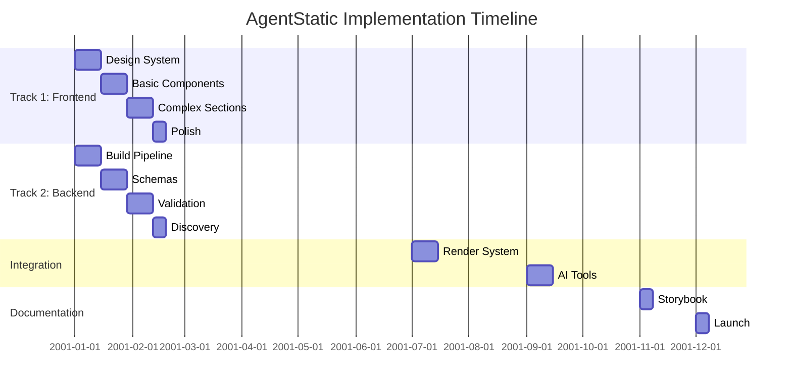

# AgentStatic FINAL PLAN

**The Unified Implementation Plan for AgentStatic**

This directory contains the consolidated, final planning documentation for AgentStatic - an AI-first static site generator for brochureware marketing websites.

---

## 🎯 Project Vision

**AgentStatic** is a three-tier platform that enables both developers and AI agents (particularly Claude) to build beautiful, accessible, performant marketing websites:

1. **Component Library**: 20-30 production-ready CSS components
2. **Build Engine**: Static site generator powered by Bun + Vite
3. **AI Integration**: Claude-optimized MCP tools for autonomous site building

---

## 🏛️ The Four Pillars

AgentStatic is built on four independent but interconnected pillars:

### [PILLAR 1: COMPONENT LIBRARY](./PILLAR-1-COMPONENTS/)
The visual component system - HTML/CSS components with zero runtime JavaScript.
- **Phase 1**: Design System Foundation (tokens, CSS architecture, dark mode)
- **Phase 2**: Basic Components (12-15 atoms & molecules)
- **Phase 3**: Complex Sections (8-10 organisms)
- **Phase 4**: Polish & Enhancement (animations, a11y, container queries)

### [PILLAR 2: REGISTRY & VALIDATION](./PILLAR-2-REGISTRY/)
Making components machine-readable and validated for AI consumption.
- **Phase 1**: Component Schema Definition (JSON schemas)
- **Phase 2**: Registry Generation (automated from components)
- **Phase 3**: Validation System (structural, semantic, accessibility)
- **Phase 4**: Discovery API (search, filter, suggest)

### [PILLAR 3: BUILD ENGINE](./PILLAR-3-BUILD/)
Transforming component compositions into optimized static sites.
- **Phase 1**: Core Pipeline (Bun + Vite setup)
- **Phase 2**: AST Processing (parse, validate, transform)
- **Phase 3**: Render System (templates to HTML)
- **Phase 4**: Output Optimization (performance, bundling)

### [PILLAR 4: AI INTEGRATION](./PILLAR-4-AI/)
Enabling Claude to autonomously build complete sites.
- **Phase 1**: MCP Tool Implementation (5 core tools)
- **Phase 2**: Composition Engine (natural language to pages)
- **Phase 3**: Validation & Feedback (errors, suggestions)
- **Phase 4**: Documentation & Examples (workflows, patterns)

---

## 📅 Implementation Timeline

### Parallel Development Tracks



**Total Duration**: 12 weeks
**Total Effort**: 250-300 hours
**Team Size**: 1-2 developers

---

## 📚 Core Documents

### Planning & Strategy
- **[ROADMAP.md](./ROADMAP.md)** - Detailed timeline, dependencies, and milestones
- **[DECISIONS.md](./DECISIONS.md)** - The 17 architectural decisions that guide the project

### Reference Documentation
- **[REFERENCE/TECHNOLOGY-STACK.md](./REFERENCE/TECHNOLOGY-STACK.md)** - Technology choices and rationale
- **[REFERENCE/SUCCESS-METRICS.md](./REFERENCE/SUCCESS-METRICS.md)** - KPIs and targets
- **[REFERENCE/STORYBOOK.md](./REFERENCE/STORYBOOK.md)** - Documentation system plan
- **[REFERENCE/GLOSSARY.md](./REFERENCE/GLOSSARY.md)** - Terms and definitions

---

## 🎯 Success Metrics

### Component Library
- ✅ 20-30 production-ready components
- ✅ WCAG AA compliance (100%)
- ✅ Mobile-first responsive design
- ✅ Dark mode support (system + manual)

### Performance
- ✅ <50KB CSS bundle (gzipped)
- ✅ 90+ Lighthouse scores
- ✅ <10 second build time
- ✅ Zero runtime JavaScript for core functionality

### AI Integration
- ✅ 5 Claude-optimized MCP tools
- ✅ <100ms component discovery
- ✅ Autonomous page composition from natural language
- ✅ Rich suggestions and error feedback

### Documentation
- ✅ 50-70 Storybook stories
- ✅ Developer guide
- ✅ AI agent guide
- ✅ 2-3 example sites

---

## 🚀 Quick Start Paths

### For Frontend Developers
Start with **[PILLAR 1: COMPONENT LIBRARY](./PILLAR-1-COMPONENTS/)**
1. Read Phase 1: Design System Foundation
2. Set up design tokens and CSS architecture
3. Build components progressively through phases 2-4

### For Backend Developers
Start with **[PILLAR 3: BUILD ENGINE](./PILLAR-3-BUILD/)**
1. Read Phase 1: Core Pipeline
2. Set up Bun + Vite environment
3. Implement AST processing and rendering

### For AI/ML Engineers
Start with **[PILLAR 4: AI INTEGRATION](./PILLAR-4-AI/)**
1. Review MCP tool specifications
2. Understand component registry structure
3. Implement tools and validation

### For Full-Stack Developers
Follow the **[ROADMAP.md](./ROADMAP.md)** for the complete implementation path.

---

## 📂 Directory Structure

```
FINALPLAN/
├── README.md                          # This file
├── ROADMAP.md                         # Timeline & dependencies
├── DECISIONS.md                       # 17 architectural decisions
│
├── PILLAR-1-COMPONENTS/              # Visual component system
│   ├── README.md
│   ├── PHASE-1-DESIGN-SYSTEM.md
│   ├── PHASE-2-BASIC-COMPONENTS.md
│   ├── PHASE-3-COMPLEX-SECTIONS.md
│   ├── PHASE-4-POLISH.md
│   └── COMPONENT-SPECS.md
│
├── PILLAR-2-REGISTRY/                # Machine-readable layer
│   ├── README.md
│   ├── PHASE-1-SCHEMAS.md
│   ├── PHASE-2-GENERATION.md
│   ├── PHASE-3-VALIDATION.md
│   ├── PHASE-4-DISCOVERY.md
│   └── AST-SCHEMA.md
│
├── PILLAR-3-BUILD/                   # Static site generation
│   ├── README.md
│   ├── PHASE-1-PIPELINE.md
│   ├── PHASE-2-AST-PROCESSING.md
│   ├── PHASE-3-RENDER.md
│   ├── PHASE-4-OPTIMIZATION.md
│   └── CLI-INTERFACE.md
│
├── PILLAR-4-AI/                      # Claude integration
│   ├── README.md
│   ├── PHASE-1-MCP-TOOLS.md
│   ├── PHASE-2-COMPOSITION.md
│   ├── PHASE-3-VALIDATION.md
│   ├── PHASE-4-DOCUMENTATION.md
│   └── MCP-TOOL-SPECS.md
│
└── REFERENCE/                        # Supporting documentation
    ├── STORYBOOK.md
    ├── TECHNOLOGY-STACK.md
    ├── SUCCESS-METRICS.md
    └── GLOSSARY.md
```

---

## 🔄 Relationship to Previous Documentation

This FINALPLAN consolidates and supersedes:
- `/PLANNING/` - Original comprehensive phase-based planning (kept for historical reference)
- `/architecture/` - Technical specifications (merged into pillar documents)
- `/CODESTYLE.md` - Remains as the active code style guide

For implementation, **always refer to FINALPLAN** as the source of truth.

---

## 📝 Key Principles

1. **Pillar Independence**: Each pillar can be developed in isolation
2. **Progressive Enhancement**: Start simple, layer complexity
3. **AI-First Design**: Every decision optimized for AI consumption
4. **Documentation-Driven**: Document before implementing
5. **Accessibility Non-Negotiable**: WCAG AA from day one
6. **Performance Budgets**: Enforce limits at every phase

---

## ❓ Where to Start?

1. **Understand the vision**: Read [DECISIONS.md](./DECISIONS.md) for the 17 guiding principles
2. **Choose your track**: Pick a pillar based on your expertise
3. **Read the pillar README**: Each pillar has its own guide
4. **Follow the phases**: Work through phases sequentially
5. **Track progress**: Use phase acceptance criteria

---

## 🎉 The Goal

By the end of this plan's implementation, AgentStatic will be:
- A **production-ready** static site generator
- With **20-30 beautiful components**
- That **Claude can use autonomously**
- To build **accessible, performant marketing sites**
- In **minutes instead of weeks**

---

*Last Updated: October 24, 2025*
*Status: Planning Complete, Ready for Implementation*