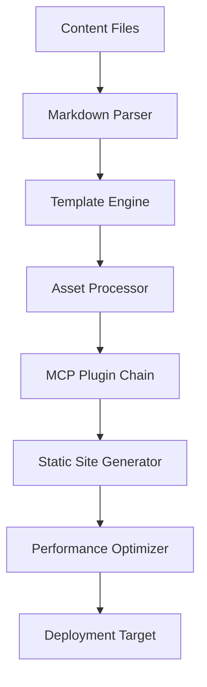

# AgentStatic - Modern Portfolio CMS with MCP Integration

> A next-generation content management system combining Markdown-driven content with AI-powered MCP extensibility, specifically designed for creative professionals and developers.

## 🎯 Project Overview

AgentStatic is a modern, extensible CMS that bridges the gap between traditional static site generators and AI-powered content management. Built for photographers, developers, and creative professionals who need both technical depth and visual showcase capabilities.

### Key Features

- **🚀 Node 24 + TypeScript**: Modern runtime with full type safety
- **📝 Markdown-Driven**: Content creation in familiar Markdown format
- **🤖 MCP Integration**: AI-powered plugins and automation via Model Context Protocol
- **📸 Portfolio-First**: Optimized for photography, video, and code showcases
- **⚡ Static Generation**: Fast, secure sites deployed to S3/CDN
- **🎨 Vanilla CSS/JS**: Zero framework dependencies for maximum performance
- **🔌 Plugin Architecture**: Extensible via MCP servers

## 🏗️ Technical Architecture

### Core Technology Stack

```
Runtime:           Node.js 24.x
Language:          TypeScript 5.x
Static Generator:  Custom (inspired by Eleventy)
UI Framework:      Vanilla CSS + TypeScript
Content Format:    Markdown with YAML frontmatter
Plugin System:     Model Context Protocol (MCP)
Deployment:        Static hosting (S3, Netlify, Vercel, GitHub Pages)
```

### Project Structure

```
AgentStatic/
├── 📁 src/                     # Core application source
│   ├── 📁 core/               # Content engine & build system
│   │   ├── builder.ts         # Static site generator
│   │   ├── markdown.ts        # Markdown parser & processor
│   │   ├── assets.ts          # Asset optimization pipeline
│   │   └── config.ts          # Configuration management
│   ├── 📁 plugins/            # MCP plugin architecture
│   │   ├── registry.ts        # Plugin discovery & loading
│   │   ├── image-processor/   # Image optimization MCP server
│   │   ├── seo-optimizer/     # SEO enhancement MCP server
│   │   └── analytics/         # Analytics integration MCP server
│   ├── 📁 templates/          # HTML template engine
│   │   ├── engine.ts          # Template processing
│   │   ├── helpers.ts         # Template helper functions
│   │   └── layouts/           # Base layout templates
│   ├── 📁 media/              # Asset processing & optimization
│   │   ├── images.ts          # Image handling (resize, compress, WebP)
│   │   ├── videos.ts          # Video processing & thumbnails
│   │   └── gallery.ts         # Gallery generation
│   ├── 📁 admin/              # Content management interface
│   │   ├── server.ts          # Admin panel server
│   │   ├── editor.ts          # Markdown editor
│   │   └── preview.ts         # Live preview system
│   └── 📁 deploy/             # Deployment automation
│       ├── s3.ts              # AWS S3 deployment
│       ├── netlify.ts         # Netlify deployment
│       └── github.ts          # GitHub Pages deployment
├── 📁 content/                # Content files
│   ├── 📁 posts/              # Blog posts
│   ├── 📁 portfolio/          # Portfolio items
│   │   ├── 📁 photography/    # Photo galleries
│   │   ├── 📁 video/          # Video projects
│   │   └── 📁 code/           # Code projects
│   └── 📁 pages/              # Static pages
├── 📁 assets/                 # Static assets
│   ├── 📁 images/             # Source images
│   ├── 📁 videos/             # Source videos
│   └── 📁 media/              # Other media files
├── 📁 themes/                 # Visual themes
│   ├── 📁 default/            # Default theme
│   │   ├── styles.css         # Theme styles
│   │   ├── layout.html        # HTML layout
│   │   └── config.json        # Theme configuration
│   └── 📁 portfolio/          # Portfolio-focused theme
├── 📁 plugins/                # Custom MCP servers
│   ├── 📁 social-media/       # Social sharing automation
│   ├── 📁 search/             # Content search & indexing
│   └── 📁 backup/             # Content backup automation
├── 📁 dist/                   # Generated static site
└── 📁 .mcpcms/                # Internal configuration
    ├── cache/                 # Build cache
    ├── plugins.json           # Plugin registry
    └── config.json            # Global configuration
```

## 🔌 MCP Integration Architecture

### Plugin System Design

AgentStatic leverages the [Model Context Protocol](https://modelcontextprotocol.io/) to create a powerful, AI-extensible plugin architecture:

```typescript
// Plugin Interface
interface MCPPlugin {
  name: string;
  version: string;
  description: string;
  capabilities: ('resources' | 'tools' | 'prompts')[];
  server: MCPServer;
}

// Core MCP Integration
class MCPRegistry {
  async loadPlugin(path: string): Promise<MCPPlugin>
  async executePlugin(name: string, operation: string, params: any): Promise<any>
  listPlugins(): MCPPlugin[]
}
```

### Built-in MCP Plugins

#### 🖼️ Image Processing Plugin
- **Auto-resize** images for responsive design
- **Format conversion** (JPEG → WebP, PNG → AVIF)
- **Compression optimization** with quality control
- **EXIF data extraction** for photography metadata
- **Thumbnail generation** with custom sizes

#### 🔍 SEO Optimization Plugin
- **Meta tag generation** from content
- **Sitemap creation** and maintenance
- **Schema.org markup** for rich snippets
- **Open Graph** and Twitter Card optimization
- **Accessibility auditing** and improvements

#### 📊 Analytics Integration Plugin
- **Google Analytics 4** integration
- **Privacy-focused alternatives** (Plausible, Fathom)
- **Performance monitoring** (Core Web Vitals)
- **Content engagement tracking**
- **Conversion funnel analysis**

#### 🌐 Social Media Plugin
- **Auto-posting** to Twitter, LinkedIn, Instagram
- **Content embedding** from social platforms
- **Share button generation**
- **Social proof display** (follower counts, shares)
- **Cross-platform content syndication**

#### 🔍 Search & Discovery Plugin
- **Full-text search indexing**
- **Elasticsearch integration**
- **Algolia search** for instant results
- **Content recommendations**
- **Tag and category management**

#### 🚀 Deployment Automation Plugin
- **Multi-platform publishing** (S3, Netlify, Vercel)
- **CDN cache invalidation**
- **Build optimization** and minification
- **Progressive deployment** with rollback
- **Performance monitoring** post-deployment

## 📸 Portfolio-Specific Features

### Photography Portfolio

#### Gallery System
```typescript
interface PhotoGallery {
  title: string;
  description: string;
  coverImage: string;
  photos: Photo[];
  metadata: {
    camera?: string;
    lens?: string;
    location?: string;
    date?: Date;
  };
}

interface Photo {
  src: string;
  alt: string;
  caption?: string;
  exif?: ExifData;
  tags: string[];
  sizes: ImageSize[];
}
```

#### Features
- **High-resolution galleries** with lazy loading
- **Responsive image serving** (WebP, AVIF, multiple sizes)
- **EXIF data display** for technical photography details
- **Lightbox viewing** with keyboard navigation
- **Category and tag organization** with filtering
- **Infinite scroll** and pagination options
- **Print optimization** for portfolio presentations

### Video Showcase

#### Video Management
```typescript
interface VideoProject {
  title: string;
  description: string;
  thumbnail: string;
  videos: VideoSource[];
  metadata: {
    duration: number;
    format: string;
    resolution: string;
    director?: string;
    client?: string;
  };
}

interface VideoSource {
  platform: 'youtube' | 'vimeo' | 'self-hosted';
  url: string;
  quality: string;
  subtitles?: SubtitleTrack[];
}
```

#### Features
- **Multi-platform embedding** (YouTube, Vimeo, self-hosted)
- **Responsive video players** with custom controls
- **Automatic thumbnail generation**
- **Video transcoding** for optimal delivery
- **Subtitle support** with multiple languages
- **Chapter markers** and interactive elements
- **Analytics integration** for view tracking

### Code Portfolio

#### Project Showcase
```typescript
interface CodeProject {
  title: string;
  description: string;
  repository: string;
  demo?: string;
  technologies: string[];
  codeExamples: CodeSnippet[];
  documentation: string;
}

interface CodeSnippet {
  language: string;
  code: string;
  filename?: string;
  highlight?: number[];
  runnable?: boolean;
}
```

#### Features
- **Syntax highlighting** for 20+ programming languages
- **Live code demos** with interactive examples
- **GitHub integration** for automatic project sync
- **Technical documentation** generation from comments
- **Code diff visualization** for before/after comparisons
- **Interactive tutorials** with step-by-step guides
- **Performance benchmarks** and metrics display

## 🚀 Development Roadmap

### Phase 1: Foundation (Weeks 1-2)
**Goal: Core infrastructure and basic functionality**

#### Week 1: Project Setup
- [ ] Node 24 + TypeScript project initialization
- [ ] Directory structure creation
- [ ] Core dependency installation
- [ ] TypeScript configuration
- [ ] ESLint and Prettier setup
- [ ] Git workflow configuration

#### Week 2: Content Engine
- [ ] Markdown parser implementation
- [ ] Frontmatter processing
- [ ] Content file discovery
- [ ] Basic template system
- [ ] File watching for development

**Deliverable**: Basic markdown-to-HTML conversion with file watching

### Phase 2: Static Generation (Weeks 3-4)
**Goal: Complete build pipeline and asset management**

#### Week 3: Build System
- [ ] Static site generation pipeline
- [ ] CSS processing and optimization
- [ ] JavaScript bundling and minification
- [ ] Asset fingerprinting for cache busting
- [ ] Development server with hot reload

#### Week 4: Asset Management
- [ ] Image optimization pipeline
- [ ] Responsive image generation
- [ ] Video processing capabilities
- [ ] Font subsetting and optimization
- [ ] Asset copying and organization

**Deliverable**: Full static site generation with optimized assets

### Phase 3: MCP Integration (Weeks 5-6)
**Goal: Plugin architecture and core MCP plugins**

#### Week 5: MCP Foundation
- [ ] MCP TypeScript SDK integration
- [ ] Plugin discovery and loading system
- [ ] Configuration management
- [ ] Plugin communication interface
- [ ] Error handling and logging

#### Week 6: Core Plugins
- [ ] Image processing MCP plugin
- [ ] SEO optimization MCP plugin
- [ ] Basic analytics integration
- [ ] Plugin configuration UI
- [ ] Plugin marketplace foundation

**Deliverable**: Working MCP plugin system with core plugins

### Phase 4: Portfolio Features (Weeks 7-8)
**Goal: Photography, video, and code showcase capabilities**

#### Week 7: Media Galleries
- [ ] Photography gallery system
- [ ] Lightbox implementation
- [ ] EXIF data extraction and display
- [ ] Video embedding and optimization
- [ ] Media organization and tagging

#### Week 8: Code Showcase
- [ ] Syntax highlighting implementation
- [ ] GitHub integration
- [ ] Live code demos
- [ ] Documentation generation
- [ ] Interactive tutorials

**Deliverable**: Complete portfolio showcase features

### Phase 5: Polish & Deployment (Weeks 9-10)
**Goal: Production-ready system with deployment options**

#### Week 9: Performance & UX
- [ ] Performance optimization
- [ ] Accessibility improvements
- [ ] Mobile responsiveness
- [ ] SEO enhancements
- [ ] Error page handling

#### Week 10: Deployment & Documentation
- [ ] S3 deployment automation
- [ ] Multi-platform deployment options
- [ ] Comprehensive documentation
- [ ] Example portfolio site
- [ ] Plugin development guide

**Deliverable**: Production-ready AgentStatic with complete documentation

## 📦 Deployment Architecture

### Static Hosting Strategy

AgentStatic generates fully static sites that can be deployed to any static hosting provider:

#### AWS S3 + CloudFront
```bash
# Automated S3 deployment
agentstatic deploy --target s3 --bucket my-portfolio --region us-east-1
```
- **Global CDN** distribution via CloudFront
- **Custom domain** and SSL certificate automation
- **Cache invalidation** on content updates
- **Cost optimization** with intelligent tiering

#### Netlify
```bash
# Continuous deployment from Git
agentstatic deploy --target netlify --site-id abc123
```
- **Git-based deployments** with branch previews
- **Form handling** for contact pages
- **Edge functions** for dynamic features
- **Built-in analytics** and performance monitoring

#### Vercel
```bash
# Optimized for performance
agentstatic deploy --target vercel --project my-portfolio
```
- **Edge optimization** with global distribution
- **Automatic performance insights**
- **Serverless functions** for dynamic content
- **GitHub integration** with preview deployments

#### GitHub Pages
```bash
# Free hosting for open source
agentstatic deploy --target github-pages --repo username/portfolio
```
- **Free hosting** for public repositories
- **Custom domain** support
- **GitHub Actions** integration for automated builds
- **Version control** with full history

### Build Pipeline



## 🎨 Unique Value Proposition

### Why AgentStatic?

1. **MCP-First Architecture**
   - AI-extensible from day one
   - Future-proof plugin system
   - Intelligent content optimization

2. **Portfolio-Optimized**
   - Built specifically for creative professionals
   - Advanced media handling capabilities
   - Showcase-focused design patterns

3. **Zero Framework Dependencies**
   - Maximum performance with vanilla CSS/JS
   - No framework lock-in or breaking changes
   - Minimal learning curve for developers

4. **Developer Experience**
   - Full TypeScript support
   - Modern tooling and workflows
   - Comprehensive documentation and examples

5. **Flexible Deployment**
   - Works with any static hosting provider
   - Automated deployment pipelines
   - Multi-environment support

## 🛠️ Getting Started

### Prerequisites

- Node.js 24.x or higher
- npm or yarn package manager
- Git for version control

### Quick Start

```bash
# Clone the repository
git clone https://github.com/conorluddy/AgentStatic.git
cd AgentStatic

# Install dependencies
npm install

# Start development server
npm run dev

# Build for production
npm run build

# Deploy to S3
npm run deploy:s3
```

### Configuration

Create a `agentstatic.config.json` file in your project root:

```json
{
  "site": {
    "title": "My Portfolio",
    "description": "A showcase of my creative work",
    "url": "https://myportfolio.com",
    "author": "Your Name"
  },
  "theme": "portfolio",
  "plugins": [
    "@agentstatic/image-processor",
    "@agentstatic/seo-optimizer",
    "@agentstatic/analytics"
  ],
  "build": {
    "output": "./dist",
    "optimization": "aggressive"
  },
  "deploy": {
    "target": "s3",
    "bucket": "my-portfolio-bucket"
  }
}
```

## 📚 Documentation

- [Getting Started Guide](./docs/getting-started.md)
- [Plugin Development](./docs/plugin-development.md)
- [Theme Creation](./docs/theme-creation.md)
- [Deployment Options](./docs/deployment.md)
- [API Reference](./docs/api-reference.md)
- [MCP Integration](./docs/mcp-integration.md)

## 🤝 Contributing

We welcome contributions! Please see our [Contributing Guide](./CONTRIBUTING.md) for details.

## 📄 License

MIT License - see [LICENSE](./LICENSE) for details.

## 🔗 Links

- [Official Website](https://agentstatic.dev)
- [Documentation](https://docs.agentstatic.dev)
- [Plugin Marketplace](https://plugins.agentstatic.dev)
- [Community Discord](https://discord.gg/agentstatic)
- [GitHub Discussions](https://github.com/conorluddy/AgentStatic/discussions)

---

Built with ❤️ for the creative community