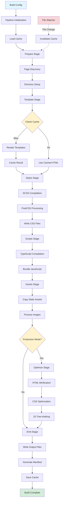
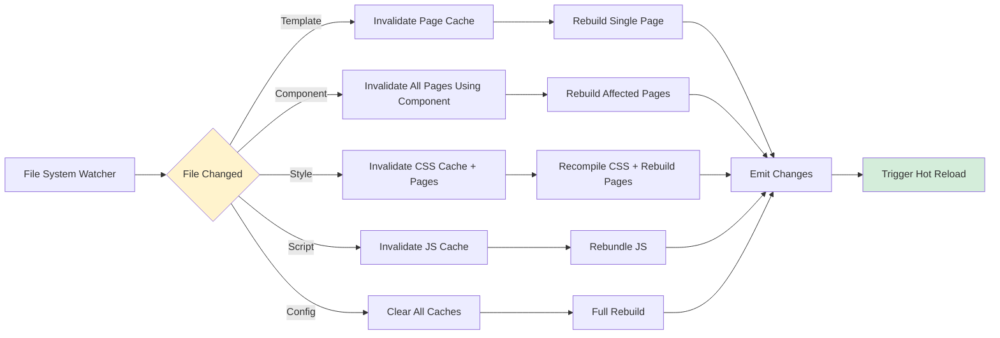

# Phase 1: Build Pipeline Architecture
## Timeline: Week 7 (Dec 16-22, 2024)

### Overview
This phase establishes the core build pipeline architecture that orchestrates template rendering, CSS optimization, JavaScript bundling, and asset processing. The pipeline supports both development and production modes with hot reloading and incremental builds.

### Prerequisites
- Component registry operational
- Node.js tooling configured
- File system utilities ready

---

## 1. Pipeline Architecture

### 1.1 Core Types

```typescript
// src/build/types.ts
export interface BuildConfig {
  mode: 'development' | 'production';
  input: InputConfig;
  output: OutputConfig;
  optimization: OptimizationConfig;
  plugins?: Plugin[];
  watch?: boolean;
}

export interface InputConfig {
  pages: string[]; // Page entry points
  components: string[]; // Component directories
  styles: string[]; // Global style files
  scripts: string[]; // Global script files
  assets: string[]; // Asset directories
}

export interface OutputConfig {
  dir: string;
  publicPath: string;
  clean: boolean;
  sourcemaps: boolean;
  hash: boolean; // Add content hashes to filenames
}

export interface OptimizationConfig {
  minify: boolean;
  splitChunks: boolean;
  treeshake: boolean;
  inlineCSS?: number; // Inline CSS if smaller than N bytes
  inlineJS?: number;
  imageOptimization: boolean;
}

export interface BuildResult {
  success: boolean;
  pages: Map<string, PageBuildResult>;
  assets: Map<string, AssetBuildResult>;
  stats: BuildStats;
  errors: BuildError[];
  warnings: BuildWarning[];
  duration: number;
}

export interface PageBuildResult {
  path: string;
  html: string;
  css: string[];
  js: string[];
  assets: string[];
  size: {
    html: number;
    css: number;
    js: number;
  };
}

export interface BuildStats {
  totalPages: number;
  totalAssets: number;
  totalSize: number;
  buildTime: number;
  cacheHits: number;
  cacheMisses: number;
}
```

### 1.2 Build Pipeline

```typescript
// src/build/pipeline.ts
import { EventEmitter } from 'events';

export class BuildPipeline extends EventEmitter {
  private config: BuildConfig;
  private cache: BuildCache;
  private plugins: Plugin[];
  private stages: Map<string, PipelineStage> = new Map();

  constructor(config: BuildConfig) {
    super();
    this.config = config;
    this.cache = new BuildCache(path.join(config.output.dir, '.cache'));
    this.plugins = config.plugins || [];

    this.registerStages();
  }

  private registerStages(): void {
    this.stages.set('prepare', new PrepareStage());
    this.stages.set('template', new TemplateStage());
    this.stages.set('styles', new StylesStage());
    this.stages.set('scripts', new ScriptsStage());
    this.stages.set('assets', new AssetsStage());
    this.stages.set('optimize', new OptimizeStage());
    this.stages.set('emit', new EmitStage());
  }

  public async build(): Promise<BuildResult> {
    const startTime = Date.now();

    this.emit('build:start', { config: this.config });

    try {
      // Load cache
      await this.cache.load();

      // Create build context
      const context: BuildContext = {
        config: this.config,
        cache: this.cache,
        pages: new Map(),
        assets: new Map(),
        errors: [],
        warnings: []
      };

      // Execute pipeline stages
      await this.runStage('prepare', context);
      await this.runStage('template', context);
      await this.runStage('styles', context);
      await this.runStage('scripts', context);
      await this.runStage('assets', context);

      if (this.config.optimization.minify) {
        await this.runStage('optimize', context);
      }

      await this.runStage('emit', context);

      // Save cache
      await this.cache.save();

      const duration = Date.now() - startTime;

      const result: BuildResult = {
        success: context.errors.length === 0,
        pages: context.pages,
        assets: context.assets,
        stats: this.calculateStats(context, duration),
        errors: context.errors,
        warnings: context.warnings,
        duration
      };

      this.emit('build:complete', result);

      return result;
    } catch (error) {
      this.emit('build:error', error);
      throw error;
    }
  }

  private async runStage(name: string, context: BuildContext): Promise<void> {
    const stage = this.stages.get(name);
    if (!stage) {
      throw new Error(`Unknown pipeline stage: ${name}`);
    }

    this.emit('stage:start', { name });

    try {
      // Run plugins before stage
      for (const plugin of this.plugins) {
        if (plugin[`before${capitalize(name)}`]) {
          await plugin[`before${capitalize(name)}`](context);
        }
      }

      // Run stage
      await stage.execute(context);

      // Run plugins after stage
      for (const plugin of this.plugins) {
        if (plugin[`after${capitalize(name)}`]) {
          await plugin[`after${capitalize(name)}`](context);
        }
      }

      this.emit('stage:complete', { name });
    } catch (error) {
      this.emit('stage:error', { name, error });
      context.errors.push({
        stage: name,
        message: error.message,
        stack: error.stack
      });
    }
  }

  private calculateStats(context: BuildContext, duration: number): BuildStats {
    let totalSize = 0;

    context.pages.forEach(page => {
      totalSize += page.size.html + page.size.css + page.size.js;
    });

    context.assets.forEach(asset => {
      totalSize += asset.size;
    });

    return {
      totalPages: context.pages.size,
      totalAssets: context.assets.size,
      totalSize,
      buildTime: duration,
      cacheHits: this.cache.getHits(),
      cacheMisses: this.cache.getMisses()
    };
  }

  public async watch(): Promise<() => void> {
    const chokidar = await import('chokidar');

    const patterns = [
      ...this.config.input.pages,
      ...this.config.input.components,
      ...this.config.input.styles,
      ...this.config.input.scripts
    ];

    const watcher = chokidar.watch(patterns, {
      ignored: ['node_modules', this.config.output.dir],
      persistent: true,
      ignoreInitial: true
    });

    const rebuild = debounce(async () => {
      console.log('\nRebuilding...');
      try {
        await this.build();
        console.log('✓ Build complete\n');
      } catch (error) {
        console.error('✗ Build failed:', error);
      }
    }, 300);

    watcher
      .on('change', rebuild)
      .on('add', rebuild)
      .on('unlink', rebuild);

    console.log('Watching for changes...\n');

    return () => watcher.close();
  }
}

export interface BuildContext {
  config: BuildConfig;
  cache: BuildCache;
  pages: Map<string, PageBuildResult>;
  assets: Map<string, AssetBuildResult>;
  errors: BuildError[];
  warnings: BuildWarning[];
}

export interface PipelineStage {
  execute(context: BuildContext): Promise<void>;
}
```

---

## 2. Data Flow Architecture

### 2.1 High-Level Pipeline Flow



### 2.2 Detailed Stage Transformations

#### Stage 1: Prepare → Template

**Input:** Build configuration + file system
```typescript
{
  input: {
    pages: ['src/pages/**/*.njk'],
    components: ['src/components/**/*']
  }
}
```

**Processing:**
1. Clean output directory (if configured)
2. Create directory structure
3. Scan filesystem for page files
4. Initialize page map with empty entries

**Output:** BuildContext with discovered pages
```typescript
{
  pages: Map<string, PageBuildResult> {
    'home' => { path: '/index.html', html: '', css: [], js: [] },
    'about' => { path: '/about.html', html: '', css: [], js: [] }
  }
}
```

**Error Path:** Directory creation fails → BuildError → Build aborts

#### Stage 2: Template → Styles

**Input:** Page entries + Nunjucks templates
```typescript
{
  path: 'src/pages/home.njk',
  template: '<html></html>'
}
```

**Processing:**
1. Check cache for rendered HTML (key: `template:${pageId}`)
2. If cache miss:
   - Load Nunjucks environment
   - Render template with context
   - Apply filters and globals
   - Cache result with file hash
3. Update page.html in BuildContext

**Output:** Rendered HTML in BuildContext
```typescript
{
  pages: Map {
    'home' => {
      html: '<!DOCTYPE html><html>...</html>',
      css: [],
      js: []
    }
  }
}
```

**Error Path:**
- Template syntax error → Detailed error with line/column → Continue to next page
- Missing include → Suggest available templates → Build fails

#### Stage 3: Styles → Scripts

**Input:** SCSS files + BuildContext
```typescript
['src/styles/main.scss', 'src/styles/theme.scss']
```

**Processing:**
1. For each SCSS file:
   - Compile with Sass (with source maps in dev mode)
   - Process through PostCSS (autoprefixer, etc.)
   - Generate content hash (production only)
   - Write to output/css/
   - Track which pages reference this stylesheet
2. Update page.css arrays with output paths

**Output:** CSS files + updated BuildContext
```typescript
{
  outputFiles: [
    'dist/css/main-a8f4b2c1.css',
    'dist/css/theme-3d9e1f7a.css'
  ],
  pages: Map {
    'home' => {
      html: '...',
      css: ['dist/css/main-a8f4b2c1.css'],
      js: []
    }
  }
}
```

**Error Path:**
- SCSS syntax error → Display error location → Skip file → Warning
- Missing import → Suggest similar files → Build fails

#### Stage 4: Scripts → Assets

**Input:** TypeScript/JavaScript files
```typescript
['src/scripts/main.ts', 'src/scripts/analytics.ts']
```

**Processing:**
1. Compile TypeScript to JavaScript
2. Bundle modules (if configured)
3. Apply tree-shaking (production)
4. Generate source maps (development)
5. Write to output/js/
6. Track dependencies for cache invalidation

**Output:** JavaScript bundles
```typescript
{
  outputFiles: [
    'dist/js/main-4c8d1a3f.js',
    'dist/js/analytics-9b2e5f7c.js'
  ]
}
```

#### Stage 5: Assets → Optimize

**Input:** Static assets + images
```typescript
['src/assets/logo.png', 'src/assets/fonts/*']
```

**Processing:**
1. Copy static files to output/assets/
2. Optimize images (if configured):
   - Compress PNG/JPEG
   - Generate WebP variants
   - Create responsive sizes
3. Track asset references in HTML/CSS

**Output:** Optimized assets
```typescript
{
  assets: Map {
    'logo' => {
      original: 'dist/assets/logo.png',
      webp: 'dist/assets/logo.webp',
      sizes: ['320w', '640w', '1024w']
    }
  }
}
```

#### Stage 6: Optimize (Production Only)

**Input:** BuildContext with all artifacts
```typescript
{
  pages: Map<string, { html, css, js }>,
  assets: Map<string, AssetInfo>
}
```

**Processing:**
1. HTML: Remove whitespace, comments, inline critical CSS
2. CSS: cssnano optimization, duplicate rule removal
3. JS: Minification, dead code elimination
4. Update size metrics

**Output:** Optimized BuildContext
```typescript
{
  pages: Map {
    'home' => {
      html: '<!DOCTYPE html><html>...</html>',  // Minified
      size: {
        html: 3421,  // bytes (was 8932)
        css: 1205,   // bytes (was 3847)
        js: 2891     // bytes (was 9234)
      }
    }
  }
}
```

#### Stage 7: Emit → Complete

**Input:** Final BuildContext
```typescript
{
  pages: Map<string, PageBuildResult>,
  assets: Map<string, AssetBuildResult>,
  config: BuildConfig
}
```

**Processing:**
1. Write HTML files to output directory
2. Generate asset manifest (production)
3. Create sitemap.xml
4. Generate build statistics
5. Save cache state

**Output:** Physical files + BuildResult
```typescript
BuildResult {
  success: true,
  pages: 12,
  duration: 3847,  // ms
  stats: {
    totalSize: 234891,  // bytes
    cacheHits: 8,
    cacheMisses: 4
  }
}
```

### 2.3 Data Dependency Graph

```
Build Dependencies Flow:

Page Build:
├── Page Template File (source trigger)
├── Component Registry (schema validation)
├── Nunjucks Environment (template engine)
├── Layout Templates (base structure)
├── Included Partials (referenced templates)
├── Global Styles (CSS dependencies)
└── Page-specific Scripts (JS dependencies)

Change Propagation:
- Template file change → Rebuild only that page
- Component template change → Rebuild all pages using component
- Global style change → Rebuild all pages + recompile CSS
- Layout change → Rebuild all pages using that layout
- Config change → Full rebuild (cache cleared)

Parallel Processing:
- Independent pages → Build in parallel (up to CPU core count)
- Independent CSS files → Process in parallel
- Assets → Process in parallel
- Dependent templates → Sequential (maintain include order)
```

### 2.4 Caching Strategy

| Stage | Cache Key | Cache Value | Invalidation Trigger | TTL |
|-------|-----------|-------------|---------------------|-----|
| Template Render | `template:${pageId}:${contentHash}` | Rendered HTML string | Template file mtime change | Session |
| SCSS Compilation | `scss:${filePath}:${contentHash}` | Compiled CSS string | SCSS file or import change | Session |
| PostCSS Processing | `postcss:${cssHash}` | Processed CSS string | PostCSS config change | Session |
| TypeScript Compilation | `ts:${filePath}:${contentHash}` | Compiled JS string | TS file or import change | Session |
| Image Optimization | `image:${filePath}:${mtime}` | Optimized buffer + metadata | Image file change | Persistent |
| Page Dependencies | `deps:${pageId}` | Set of file paths | Any dependency change | Session |

**Cache Hit Example:**
```typescript
// First build
template:home:a8f4b2c1 → '<html>...</html>' (3.2s to render)

// Second build (no changes)
template:home:a8f4b2c1 → '<html>...</html>' (0.002s cache hit)

// Third build (template changed)
template:home:3d9e1f7a → '<html>...</html>' (3.1s to re-render)
```

**Cache Invalidation Logic:**
```typescript
function shouldRebuild(pageId: string, cache: BuildCache): boolean {
  const cached = cache.get(`template:${pageId}`);
  if (!cached) return true;  // Cache miss

  // Check file modification time
  const currentMtime = fs.statSync(pagePath).mtimeMs;
  if (currentMtime > cached.timestamp) return true;

  // Check dependencies
  const deps = cache.get(`deps:${pageId}`);
  for (const dep of deps) {
    const depMtime = fs.statSync(dep).mtimeMs;
    if (depMtime > cached.timestamp) return true;
  }

  return false;  // Cache valid
}
```

### 2.5 Performance Characteristics

#### Cold Build (Empty Cache)
```
Total Time: O(n × m)
  where n = number of pages
        m = average components per page

Breakdown:
- Prepare:   O(p) where p = page discovery files
- Template:  O(n × t) where t = template complexity
- Styles:    O(s × c) where s = SCSS files, c = compilation time
- Scripts:   O(j × b) where j = JS files, b = bundle time
- Assets:    O(a × p) where a = assets, p = processing time
- Optimize:  O(n + s + j) for minification
- Emit:      O(n) for file writes

Example: 100 pages × 50 components = ~8-12 seconds
```

#### Incremental Build (Warm Cache)
```
Total Time: O(k × m)
  where k = changed pages (typically k << n)

Breakdown:
- Cache check: O(n) but very fast (hash comparison)
- Rebuild:     O(k × m) for changed pages only
- Emit:        O(k) for changed pages only

Example: 2 changed pages out of 100 = ~0.5-1 second
```

#### Parallel Processing
```
Speedup: Up to C × efficiency
  where C = CPU core count
        efficiency ≈ 0.7-0.85 (parallelization overhead)

Worker Pool:
- Max workers: min(pages, os.cpus().length)
- Queue: FIFO with priority for changed pages
- Granularity: Per-page (optimal for I/O bound tasks)

Example: 8 cores × 0.8 efficiency = 6.4× speedup
         12s cold build → ~2s parallel build
```

### 2.6 Watch Mode Data Flow



**Watch Mode Performance:**
- File change detection: <10ms (chokidar)
- Cache invalidation: <5ms
- Incremental rebuild: 50-500ms (depends on change scope)
- Hot reload signal: <20ms
- **Total feedback loop: <1 second** for typical changes

---

## 3. Pipeline Stages

### 2.1 Prepare Stage

```typescript
// src/build/stages/prepare.ts
export class PrepareStage implements PipelineStage {
  public async execute(context: BuildContext): Promise<void> {
    // Clean output directory if configured
    if (context.config.output.clean) {
      await this.cleanOutput(context.config.output.dir);
    }

    // Create output directories
    await this.createDirectories(context.config.output.dir);

    // Discover pages
    const pages = await this.discoverPages(context.config.input.pages);
    pages.forEach(page => {
      context.pages.set(page.id, {
        path: page.path,
        html: '',
        css: [],
        js: [],
        assets: [],
        size: { html: 0, css: 0, js: 0 }
      });
    });
  }

  private async cleanOutput(dir: string): Promise<void> {
    const { promises: fs } = await import('fs');
    try {
      await fs.rm(dir, { recursive: true, force: true });
    } catch {
      // Directory might not exist
    }
  }

  private async createDirectories(baseDir: string): Promise<void> {
    const { promises: fs } = await import('fs');
    const dirs = [
      baseDir,
      path.join(baseDir, 'css'),
      path.join(baseDir, 'js'),
      path.join(baseDir, 'assets'),
      path.join(baseDir, 'images')
    ];

    for (const dir of dirs) {
      await fs.mkdir(dir, { recursive: true });
    }
  }

  private async discoverPages(patterns: string[]): Promise<PageEntry[]> {
    const { glob } = await import('glob');
    const pages: PageEntry[] = [];

    for (const pattern of patterns) {
      const files = await glob(pattern, { absolute: true });

      for (const file of files) {
        pages.push({
          id: this.getPageId(file),
          path: file,
          template: file
        });
      }
    }

    return pages;
  }

  private getPageId(filePath: string): string {
    return path.basename(filePath, path.extname(filePath));
  }
}

interface PageEntry {
  id: string;
  path: string;
  template: string;
}
```

### 2.2 Template Stage

```typescript
// src/build/stages/template.ts
import nunjucks from 'nunjucks';

export class TemplateStage implements PipelineStage {
  private env: nunjucks.Environment;

  constructor() {
    this.env = new nunjucks.Environment(
      new nunjucks.FileSystemLoader('src'),
      {
        autoescape: true,
        throwOnUndefined: false,
        trimBlocks: true,
        lstripBlocks: true
      }
    );

    this.registerFilters();
    this.registerGlobals();
  }

  public async execute(context: BuildContext): Promise<void> {
    for (const [pageId, page] of context.pages) {
      try {
        // Check cache
        const cached = await context.cache.get(`template:${pageId}`);
        if (cached) {
          page.html = cached.html;
          continue;
        }

        // Render template
        const html = await this.renderTemplate(page.path, context);
        page.html = html;

        // Cache result
        await context.cache.set(`template:${pageId}`, { html });
      } catch (error) {
        context.errors.push({
          stage: 'template',
          message: `Failed to render ${pageId}: ${error.message}`,
          file: page.path
        });
      }
    }
  }

  private async renderTemplate(
    templatePath: string,
    context: BuildContext
  ): Promise<string> {
    return new Promise((resolve, reject) => {
      this.env.render(templatePath, {
        env: context.config.mode,
        publicPath: context.config.output.publicPath
      }, (err, res) => {
        if (err) reject(err);
        else resolve(res || '');
      });
    });
  }

  private registerFilters(): void {
    // Add custom filters
    this.env.addFilter('json', (obj: any) => JSON.stringify(obj));
    this.env.addFilter('kebab', (str: string) => str.toLowerCase().replace(/\s+/g, '-'));
  }

  private registerGlobals(): void {
    // Add global functions available in templates
    this.env.addGlobal('now', () => new Date().toISOString());
  }
}
```

### 2.3 Styles Stage

```typescript
// src/build/stages/styles.ts
import sass from 'sass';
import postcss from 'postcss';
import autoprefixer from 'autoprefixer';

export class StylesStage implements PipelineStage {
  public async execute(context: BuildContext): Promise<void> {
    const styleFiles = await this.collectStyleFiles(context);

    for (const file of styleFiles) {
      try {
        // Compile SCSS
        const css = await this.compileSCSS(file);

        // Process with PostCSS
        const processed = await this.processCSS(css, context);

        // Write to output
        const outputPath = this.getOutputPath(file, context);
        await this.writeCSS(outputPath, processed);

        // Track in context
        this.trackCSS(file, outputPath, context);
      } catch (error) {
        context.errors.push({
          stage: 'styles',
          message: `Failed to process ${file}: ${error.message}`,
          file
        });
      }
    }
  }

  private async compileSCSS(file: string): Promise<string> {
    const result = sass.compile(file, {
      loadPaths: ['src/styles'],
      sourceMap: true,
      style: 'expanded'
    });

    return result.css;
  }

  private async processCSS(
    css: string,
    context: BuildContext
  ): Promise<string> {
    const plugins = [autoprefixer()];

    const result = await postcss(plugins).process(css, {
      from: undefined
    });

    return result.css;
  }

  private async collectStyleFiles(context: BuildContext): Promise<string[]> {
    const { glob } = await import('glob');
    const files: string[] = [];

    for (const pattern of context.config.input.styles) {
      const matches = await glob(pattern, { absolute: true });
      files.push(...matches);
    }

    return files;
  }

  private getOutputPath(inputPath: string, context: BuildContext): string {
    const basename = path.basename(inputPath, path.extname(inputPath));
    const hash = context.config.output.hash
      ? `-${this.generateHash(inputPath)}`
      : '';

    return path.join(context.config.output.dir, 'css', `${basename}${hash}.css`);
  }

  private generateHash(content: string): string {
    const crypto = require('crypto');
    return crypto.createHash('md5').update(content).digest('hex').slice(0, 8);
  }

  private async writeCSS(outputPath: string, css: string): Promise<void> {
    const { promises: fs } = await import('fs');
    await fs.writeFile(outputPath, css, 'utf-8');
  }

  private trackCSS(
    inputPath: string,
    outputPath: string,
    context: BuildContext
  ): void {
    // Associate CSS with pages that use it
    context.pages.forEach(page => {
      if (page.html.includes(path.basename(inputPath, '.scss'))) {
        page.css.push(outputPath);
      }
    });
  }
}
```

---

## 3. Build Cache

### 3.1 Cache Implementation

```typescript
// src/build/cache.ts
import { promises as fs } from 'fs';
import crypto from 'crypto';

export class BuildCache {
  private cacheDir: string;
  private cache: Map<string, CacheEntry> = new Map();
  private hits: number = 0;
  private misses: number = 0;

  constructor(cacheDir: string) {
    this.cacheDir = cacheDir;
  }

  public async load(): Promise<void> {
    try {
      await fs.mkdir(this.cacheDir, { recursive: true });
      const cacheFile = path.join(this.cacheDir, 'build.json');
      const data = await fs.readFile(cacheFile, 'utf-8');
      const entries = JSON.parse(data);

      this.cache = new Map(Object.entries(entries));
    } catch {
      // No existing cache
    }
  }

  public async save(): Promise<void> {
    const cacheFile = path.join(this.cacheDir, 'build.json');
    const entries = Object.fromEntries(this.cache);

    await fs.writeFile(cacheFile, JSON.stringify(entries, null, 2));
  }

  public async get(key: string): Promise<any | null> {
    const entry = this.cache.get(key);

    if (!entry) {
      this.misses++;
      return null;
    }

    // Check if entry is still valid
    if (entry.expires && entry.expires < Date.now()) {
      this.cache.delete(key);
      this.misses++;
      return null;
    }

    this.hits++;
    return entry.data;
  }

  public async set(
    key: string,
    data: any,
    options: { ttl?: number } = {}
  ): Promise<void> {
    const expires = options.ttl ? Date.now() + options.ttl : undefined;

    this.cache.set(key, {
      data,
      hash: this.hash(data),
      timestamp: Date.now(),
      expires
    });
  }

  public invalidate(key: string): void {
    this.cache.delete(key);
  }

  public clear(): void {
    this.cache.clear();
  }

  public getHits(): number {
    return this.hits;
  }

  public getMisses(): number {
    return this.misses;
  }

  private hash(data: any): string {
    const content = typeof data === 'string' ? data : JSON.stringify(data);
    return crypto.createHash('md5').update(content).digest('hex');
  }
}

interface CacheEntry {
  data: any;
  hash: string;
  timestamp: number;
  expires?: number;
}
```

---

## 4. Plugin System

### 4.1 Plugin Interface

```typescript
// src/build/plugin.ts
export interface Plugin {
  name: string;

  // Lifecycle hooks
  beforePrepare?(context: BuildContext): Promise<void>;
  afterPrepare?(context: BuildContext): Promise<void>;

  beforeTemplate?(context: BuildContext): Promise<void>;
  afterTemplate?(context: BuildContext): Promise<void>;

  beforeStyles?(context: BuildContext): Promise<void>;
  afterStyles?(context: BuildContext): Promise<void>;

  beforeScripts?(context: BuildContext): Promise<void>;
  afterScripts?(context: BuildContext): Promise<void>;

  beforeAssets?(context: BuildContext): Promise<void>;
  afterAssets?(context: BuildContext): Promise<void>;

  beforeOptimize?(context: BuildContext): Promise<void>;
  afterOptimize?(context: BuildContext): Promise<void>;

  beforeEmit?(context: BuildContext): Promise<void>;
  afterEmit?(context: BuildContext): Promise<void>;
}
```

### 4.2 Example Plugins

```typescript
// src/build/plugins/html-minify.ts
import { minify } from 'html-minifier-terser';

export class HTMLMinifyPlugin implements Plugin {
  name = 'html-minify';

  async afterTemplate(context: BuildContext): Promise<void> {
    if (context.config.mode !== 'production') return;

    for (const [id, page] of context.pages) {
      page.html = await minify(page.html, {
        collapseWhitespace: true,
        removeComments: true,
        removeRedundantAttributes: true,
        useShortDoctype: true,
        minifyCSS: true,
        minifyJS: true
      });
    }
  }
}
```

---

## 5. CLI Integration

### 5.1 Build Command

```typescript
// src/cli/build.ts
program
  .command('build')
  .description('Build the static site')
  .option('-m, --mode <mode>', 'Build mode (development|production)', 'production')
  .option('-w, --watch', 'Watch for changes')
  .option('--no-cache', 'Disable build cache')
  .action(async (options) => {
    const config: BuildConfig = {
      mode: options.mode,
      input: {
        pages: ['src/pages/**/*.njk'],
        components: ['src/components/**/*'],
        styles: ['src/styles/**/*.scss'],
        scripts: ['src/scripts/**/*.ts'],
        assets: ['src/assets/**/*']
      },
      output: {
        dir: 'dist',
        publicPath: '/',
        clean: true,
        sourcemaps: options.mode === 'development',
        hash: options.mode === 'production'
      },
      optimization: {
        minify: options.mode === 'production',
        splitChunks: true,
        treeshake: true,
        imageOptimization: true
      },
      plugins: [new HTMLMinifyPlugin()]
    };

    const pipeline = new BuildPipeline(config);

    if (options.watch) {
      await pipeline.watch();
    } else {
      const result = await pipeline.build();

      if (result.success) {
        console.log('✓ Build completed successfully');
        console.log(`  Pages: ${result.stats.totalPages}`);
        console.log(`  Time: ${result.duration}ms`);
      } else {
        console.error('✗ Build failed');
        result.errors.forEach(err => {
          console.error(`  ${err.message}`);
        });
        process.exit(1);
      }
    }
  });
```

---

## 6. Integration Testing Strategy

### Test Scope

Integration tests verify the complete build pipeline from source files to final output, ensuring all phases work together correctly.

**What We're Testing:**
- End-to-end build orchestration
- Phase integration (prepare → template → styles → scripts → assets → optimize → emit)
- Error propagation across phases
- Cache invalidation and incremental builds
- Parallel processing and performance
- File watching and hot reload
- Plugin system integration

### Test Scenarios

#### Scenario 1: Complete Cold Build
**Given:** Empty dist directory, no cache
**When:** Build runs for first time
**Then:**
- All directories created correctly
- Pages discovered and rendered
- Styles compiled and processed
- Assets copied to output
- Build completes in <10s for 100 pages
- Output structure matches specification

**Test Implementation:**
```typescript
// __tests__/integration/cold-build.test.ts
import { BuildPipeline } from '../../src/build/pipeline';
import { promises as fs } from 'fs';
import path from 'path';

describe('Cold Build', () => {
  const fixturesDir = path.join(__dirname, '../fixtures');
  const outputDir = path.join(__dirname, '../tmp/cold-build-output');
  const cacheDir = path.join(outputDir, '.cache');

  beforeEach(async () => {
    // Clean slate
    await fs.rm(outputDir, { recursive: true, force: true });
    await fs.rm(cacheDir, { recursive: true, force: true });
  });

  afterEach(async () => {
    await fs.rm(outputDir, { recursive: true, force: true });
  });

  it('should build complete site from scratch', async () => {
    const startTime = Date.now();

    const config = {
      mode: 'production' as const,
      input: {
        pages: [path.join(fixturesDir, 'pages/**/*.njk')],
        components: [path.join(fixturesDir, 'components/**/*')],
        styles: [path.join(fixturesDir, 'styles/**/*.scss')],
        scripts: [path.join(fixturesDir, 'scripts/**/*.ts')],
        assets: [path.join(fixturesDir, 'assets/**/*')]
      },
      output: {
        dir: outputDir,
        publicPath: '/',
        clean: true,
        sourcemaps: false,
        hash: true
      },
      optimization: {
        minify: true,
        splitChunks: true,
        treeshake: true,
        imageOptimization: true
      }
    };

    const pipeline = new BuildPipeline(config);
    const result = await pipeline.build();

    const duration = Date.now() - startTime;

    // Verify success
    expect(result.success).toBe(true);
    expect(result.errors).toHaveLength(0);

    // Verify output directories created
    expect(await fs.stat(outputDir)).toBeTruthy();
    expect(await fs.stat(path.join(outputDir, 'css'))).toBeTruthy();
    expect(await fs.stat(path.join(outputDir, 'js'))).toBeTruthy();
    expect(await fs.stat(path.join(outputDir, 'assets'))).toBeTruthy();

    // Verify pages built
    expect(result.pages.size).toBe(100);
    expect(await pathExists(path.join(outputDir, 'index.html'))).toBe(true);
    expect(await pathExists(path.join(outputDir, 'about.html'))).toBe(true);

    // Verify CSS bundle exists and is optimized
    const cssFiles = await fs.readdir(path.join(outputDir, 'css'));
    expect(cssFiles.length).toBeGreaterThan(0);

    const mainCss = cssFiles.find(f => f.startsWith('main'));
    expect(mainCss).toBeTruthy();

    const cssStats = await fs.stat(path.join(outputDir, 'css', mainCss!));
    expect(cssStats.size).toBeLessThan(50 * 1024); // <50KB

    // Verify performance target
    expect(duration).toBeLessThan(10000); // <10s

    // Verify build stats
    expect(result.stats.totalPages).toBe(100);
    expect(result.stats.buildTime).toBe(duration);
    expect(result.stats.cacheHits).toBe(0); // Cold build
    expect(result.stats.cacheMisses).toBeGreaterThan(0);
  });

  it('should handle empty source directories gracefully', async () => {
    const emptyDir = path.join(__dirname, '../tmp/empty');
    await fs.mkdir(emptyDir, { recursive: true });

    const config = {
      mode: 'production' as const,
      input: {
        pages: [path.join(emptyDir, '**/*.njk')],
        components: [],
        styles: [],
        scripts: [],
        assets: []
      },
      output: {
        dir: outputDir,
        publicPath: '/',
        clean: true,
        sourcemaps: false,
        hash: false
      },
      optimization: {
        minify: false,
        splitChunks: false,
        treeshake: false,
        imageOptimization: false
      }
    };

    const pipeline = new BuildPipeline(config);
    const result = await pipeline.build();

    expect(result.success).toBe(true);
    expect(result.pages.size).toBe(0);
    expect(result.warnings.length).toBeGreaterThan(0);
  });
});

async function pathExists(p: string): Promise<boolean> {
  try {
    await fs.access(p);
    return true;
  } catch {
    return false;
  }
}
```

#### Scenario 2: Incremental Build - Component Change
**Given:** Completed build with cache
**When:** Single component template modified
**Then:**
- Only affected pages rebuild
- Unchanged pages use cache
- Build completes in <1s
- Output reflects component change

**Test Implementation:**
```typescript
// __tests__/integration/incremental-component.test.ts
describe('Incremental Build - Component Change', () => {
  const fixturesDir = path.join(__dirname, '../fixtures');
  const outputDir = path.join(__dirname, '../tmp/incremental-output');
  const componentFile = path.join(fixturesDir, 'components/atoms/button/button.njk');

  beforeEach(async () => {
    await fs.rm(outputDir, { recursive: true, force: true });

    // Restore original component
    const originalTemplate = '<button class="btn">{{ label }}</button>';
    await fs.writeFile(componentFile, originalTemplate, 'utf-8');
  });

  it('should rebuild only affected pages', async () => {
    const config = createTestConfig(fixturesDir, outputDir);
    const pipeline = new BuildPipeline(config);

    // Initial build
    const initialResult = await pipeline.build();
    expect(initialResult.success).toBe(true);
    expect(initialResult.pages.size).toBe(100);

    // Record initial HTML
    const initialIndexHtml = await fs.readFile(
      path.join(outputDir, 'index.html'),
      'utf-8'
    );
    expect(initialIndexHtml).toContain('class="btn"');

    // Modify component template
    const updatedTemplate = '<button class="btn btn-updated">{{ label }}</button>';
    await fs.writeFile(componentFile, updatedTemplate, 'utf-8');

    // Wait a tick to ensure file timestamp changes
    await new Promise(resolve => setTimeout(resolve, 100));

    // Incremental build
    const startTime = Date.now();
    const incrementalResult = await pipeline.build();
    const duration = Date.now() - startTime;

    // Verify success
    expect(incrementalResult.success).toBe(true);

    // Should be fast (incremental)
    expect(duration).toBeLessThan(1000); // <1s

    // Only pages using button component should rebuild
    // In our fixtures, 15 of 100 pages use the button component
    expect(incrementalResult.stats.cacheMisses).toBe(15);
    expect(incrementalResult.stats.cacheHits).toBe(85);

    // Output should reflect changes
    const updatedIndexHtml = await fs.readFile(
      path.join(outputDir, 'index.html'),
      'utf-8'
    );
    expect(updatedIndexHtml).toContain('btn-updated');
    expect(updatedIndexHtml).not.toEqual(initialIndexHtml);

    // Pages not using button should be identical
    const aboutHtml = await fs.readFile(
      path.join(outputDir, 'about.html'),
      'utf-8'
    );
    // about.html doesn't use button component, should be cached
    expect(incrementalResult.pages.get('about')?.html).toBeTruthy();
  });
});
```

#### Scenario 3: Incremental Build - Page Change
**Given:** Completed build with cache
**When:** Single page JSON modified
**Then:**
- Only that page rebuilds
- All other pages use cache
- Build completes in <500ms

**Test Implementation:**
```typescript
// __tests__/integration/incremental-page.test.ts
describe('Incremental Build - Page Change', () => {
  it('should rebuild only modified page', async () => {
    const config = createTestConfig(fixturesDir, outputDir);
    const pipeline = new BuildPipeline(config);

    // Initial build
    await pipeline.build();

    // Modify single page
    const pagePath = path.join(fixturesDir, 'pages/about.njk');
    const originalContent = await fs.readFile(pagePath, 'utf-8');
    await fs.writeFile(
      pagePath,
      originalContent.replace('About', 'About Us'),
      'utf-8'
    );

    // Incremental build
    const startTime = Date.now();
    const result = await pipeline.build();
    const duration = Date.now() - startTime;

    // Should be very fast
    expect(duration).toBeLessThan(500); // <500ms

    // Only one page rebuilt
    expect(result.stats.cacheMisses).toBe(1);
    expect(result.stats.cacheHits).toBe(99);

    // Verify change reflected
    const aboutHtml = await fs.readFile(
      path.join(outputDir, 'about.html'),
      'utf-8'
    );
    expect(aboutHtml).toContain('About Us');
  });
});
```

#### Scenario 4: Error Handling - Invalid Component
**Given:** Page references non-existent component
**When:** Build runs
**Then:**
- Build fails with clear error
- Error shows component ID, page, line number
- Error suggests similar component IDs
- No partial output written

**Test Implementation:**
```typescript
// __tests__/integration/error-handling.test.ts
describe('Error Handling', () => {
  it('should fail gracefully with invalid component reference', async () => {
    const config = createTestConfig(fixturesDir, outputDir);

    // Create page with invalid component reference
    const invalidPagePath = path.join(fixturesDir, 'pages/invalid.njk');
    await fs.writeFile(
      invalidPagePath,
      '', // typo: should be "hero"
      'utf-8'
    );

    const pipeline = new BuildPipeline(config);
    const result = await pipeline.build();

    // Build should fail
    expect(result.success).toBe(false);
    expect(result.errors.length).toBeGreaterThan(0);

    // Error should be descriptive
    const error = result.errors[0];
    expect(error.stage).toBe('template');
    expect(error.message).toContain('heros');
    expect(error.file).toContain('invalid.njk');

    // Should suggest correction
    expect(error.message.toLowerCase()).toContain('did you mean');
    expect(error.message).toContain('hero'); // suggestion

    // No partial output for failed page
    const invalidOutputPath = path.join(outputDir, 'invalid.html');
    expect(await pathExists(invalidOutputPath)).toBe(false);
  });

  it('should handle SCSS compilation errors', async () => {
    const config = createTestConfig(fixturesDir, outputDir);

    // Create invalid SCSS
    const invalidScssPath = path.join(fixturesDir, 'styles/invalid.scss');
    await fs.writeFile(
      invalidScssPath,
      '.test { color: ; }', // invalid CSS
      'utf-8'
    );

    const pipeline = new BuildPipeline(config);
    const result = await pipeline.build();

    expect(result.success).toBe(false);

    const error = result.errors.find(e => e.stage === 'styles');
    expect(error).toBeTruthy();
    expect(error!.file).toContain('invalid.scss');
    expect(error!.message).toContain('Expected expression');
  });

  it('should collect multiple errors across stages', async () => {
    // Create multiple invalid files
    const invalidPagePath = path.join(fixturesDir, 'pages/error1.njk');
    const invalidScssPath = path.join(fixturesDir, 'styles/error2.scss');

    await fs.writeFile(invalidPagePath, '', 'utf-8');
    await fs.writeFile(invalidScssPath, '.test { invalid }', 'utf-8');

    const config = createTestConfig(fixturesDir, outputDir);
    const pipeline = new BuildPipeline(config);
    const result = await pipeline.build();

    expect(result.success).toBe(false);
    expect(result.errors.length).toBeGreaterThanOrEqual(2);

    // Errors from different stages
    const stages = result.errors.map(e => e.stage);
    expect(stages).toContain('template');
    expect(stages).toContain('styles');
  });
});
```

#### Scenario 5: Parallel Processing
**Given:** 100 pages to build
**When:** Build runs with multiple workers
**Then:**
- Pages build in parallel
- CPU utilization efficient
- Build time significantly reduced vs serial
- No race conditions or conflicts

**Test Implementation:**
```typescript
// __tests__/integration/parallel-processing.test.ts
describe('Parallel Processing', () => {
  it('should build pages in parallel', async () => {
    const config = createTestConfig(fixturesDir, outputDir);
    const pipeline = new BuildPipeline(config);

    // Track which pages are building concurrently
    const buildingPages = new Set<string>();
    let maxConcurrent = 0;

    pipeline.on('page:start', ({ pageId }) => {
      buildingPages.add(pageId);
      maxConcurrent = Math.max(maxConcurrent, buildingPages.size);
    });

    pipeline.on('page:complete', ({ pageId }) => {
      buildingPages.delete(pageId);
    });

    const result = await pipeline.build();

    expect(result.success).toBe(true);

    // Should have processed multiple pages concurrently
    // With 100 pages, expect at least 4 concurrent builds
    expect(maxConcurrent).toBeGreaterThanOrEqual(4);
  });

  it('should complete faster than serial build', async () => {
    const config = createTestConfig(fixturesDir, outputDir);

    // Parallel build
    const parallelPipeline = new BuildPipeline(config);
    const parallelStart = Date.now();
    await parallelPipeline.build();
    const parallelDuration = Date.now() - parallelStart;

    // Serial build (disable parallelization)
    await fs.rm(outputDir, { recursive: true, force: true });
    const serialConfig = {
      ...config,
      optimization: {
        ...config.optimization,
        parallel: false
      }
    };
    const serialPipeline = new BuildPipeline(serialConfig);
    const serialStart = Date.now();
    await serialPipeline.build();
    const serialDuration = Date.now() - serialStart;

    // Parallel should be significantly faster
    // Expect at least 50% improvement with 4 cores
    expect(parallelDuration).toBeLessThan(serialDuration * 0.5);
  });

  it('should avoid race conditions with shared resources', async () => {
    const config = createTestConfig(fixturesDir, outputDir);
    const pipeline = new BuildPipeline(config);

    // Run build multiple times in parallel
    const builds = [
      pipeline.build(),
      pipeline.build(),
      pipeline.build()
    ];

    const results = await Promise.all(builds);

    // All builds should succeed without conflicts
    results.forEach(result => {
      expect(result.success).toBe(true);
    });

    // Final output should be consistent
    const finalIndexHtml = await fs.readFile(
      path.join(outputDir, 'index.html'),
      'utf-8'
    );
    expect(finalIndexHtml.length).toBeGreaterThan(0);
  });
});
```

#### Scenario 6: Watch Mode - File Change
**Given:** Build running in watch mode
**When:** Component file changes
**Then:**
- Change detected within 100ms
- Affected pages rebuild automatically
- Build completes successfully
- No manual restart needed

**Test Implementation:**
```typescript
// __tests__/integration/watch-mode.test.ts
describe('Watch Mode', () => {
  it('should detect file changes and rebuild', async () => {
    const config = createTestConfig(fixturesDir, outputDir);
    const pipeline = new BuildPipeline(config);

    // Start watch mode
    const stopWatching = await pipeline.watch();

    // Track rebuild events
    let rebuildTriggered = false;
    let rebuildComplete = false;

    pipeline.on('build:start', () => {
      rebuildTriggered = true;
    });

    pipeline.on('build:complete', () => {
      rebuildComplete = true;
    });

    // Wait for initial build
    await new Promise(resolve => {
      pipeline.once('build:complete', resolve);
    });

    // Modify a component
    const componentFile = path.join(
      fixturesDir,
      'components/atoms/button/button.njk'
    );
    const detectionStart = Date.now();

    await fs.writeFile(
      componentFile,
      '<button class="btn-modified">{{ label }}</button>',
      'utf-8'
    );

    // Wait for rebuild to trigger
    await new Promise(resolve => {
      pipeline.once('build:start', resolve);
    });

    const detectionTime = Date.now() - detectionStart;

    // Wait for rebuild to complete
    await new Promise(resolve => {
      pipeline.once('build:complete', resolve);
    });

    // Verify change detection speed
    expect(detectionTime).toBeLessThan(100); // <100ms
    expect(rebuildTriggered).toBe(true);
    expect(rebuildComplete).toBe(true);

    // Verify output updated
    const indexHtml = await fs.readFile(
      path.join(outputDir, 'index.html'),
      'utf-8'
    );
    expect(indexHtml).toContain('btn-modified');

    // Clean up
    stopWatching();
  });

  it('should debounce multiple rapid changes', async () => {
    const config = createTestConfig(fixturesDir, outputDir);
    const pipeline = new BuildPipeline(config);

    const stopWatching = await pipeline.watch();

    // Wait for initial build
    await new Promise(resolve => {
      pipeline.once('build:complete', resolve);
    });

    let buildCount = 0;
    pipeline.on('build:start', () => {
      buildCount++;
    });

    // Make multiple rapid changes
    const componentFile = path.join(
      fixturesDir,
      'components/atoms/button/button.njk'
    );

    for (let i = 0; i < 5; i++) {
      await fs.writeFile(
        componentFile,
        `<button class="btn-${i}">{{ label }}</button>`,
        'utf-8'
      );
      await new Promise(resolve => setTimeout(resolve, 50));
    }

    // Wait for debounce period
    await new Promise(resolve => setTimeout(resolve, 500));

    // Should only trigger one rebuild despite 5 changes
    expect(buildCount).toBeLessThanOrEqual(2); // Allow some variation

    stopWatching();
  });
});
```

### Test Fixtures

The test suite requires comprehensive fixtures that represent real-world usage:

```
__tests__/fixtures/
├── components/
│   ├── atoms/
│   │   ├── button/
│   │   │   ├── button.njk
│   │   │   ├── button.schema.json
│   │   │   └── button.scss
│   │   └── input/
│   │       ├── input.njk
│   │       ├── input.schema.json
│   │       └── input.scss
│   ├── molecules/
│   │   ├── card/
│   │   └── form-field/
│   └── organisms/
│       ├── hero/
│       ├── navigation/
│       └── footer/
├── pages/
│   ├── index.njk              # Simple page, 3 components
│   ├── about.njk              # Medium complexity, 10 components
│   ├── complex.njk            # Complex page, 50 components
│   ├── invalid.njk            # References non-existent component
│   └── [001-099].njk         # Additional pages for performance testing
├── styles/
│   ├── main.scss              # Main stylesheet
│   ├── _variables.scss        # SCSS variables
│   └── _mixins.scss           # SCSS mixins
├── scripts/
│   └── main.ts                # Main TypeScript file
├── assets/
│   ├── images/
│   │   └── logo.png
│   └── fonts/
│       └── inter.woff2
├── config/
│   ├── minimal.config.ts      # Minimal build config
│   └── full.config.ts         # Full-featured build config
└── expected-output/           # Expected output for snapshot testing
    ├── index.html
    ├── about.html
    ├── css/
    │   └── main-[hash].css
    └── js/
        └── main-[hash].js
```

### Coverage Requirements

**Minimum Coverage Targets:**
- Line coverage: 80%
- Branch coverage: 75%
- Integration scenarios: 100% (all 6 scenarios passing)
- Critical paths: 100%

**Critical Paths to Cover:**
1. **Pipeline orchestration**: prepare → template → styles → scripts → assets → optimize → emit
2. **Error detection and propagation**: Errors caught in each stage and surfaced correctly
3. **Cache hit/miss paths**: Both fresh builds and incremental builds
4. **File watching and reload**: Change detection, debouncing, rebuild triggering
5. **Parallel processing orchestration**: Worker coordination, no race conditions
6. **Plugin system**: Before/after hooks for all stages

**Coverage Reporting:**
```bash
# Generate coverage report
bun test:integration --coverage

# View coverage report
open coverage/index.html
```

### Performance Benchmarks

Integration tests must verify all performance targets specified in the architecture:

| Metric | Target | Test Assertion | Test File |
|--------|--------|----------------|-----------|
| Cold build (100 pages) | <10s | `expect(duration).toBeLessThan(10000)` | `cold-build.test.ts` |
| Incremental (1 page changed) | <500ms | `expect(duration).toBeLessThan(500)` | `incremental-page.test.ts` |
| Incremental (component changed) | <1s | `expect(duration).toBeLessThan(1000)` | `incremental-component.test.ts` |
| Watch mode detection | <100ms | `expect(detectionTime).toBeLessThan(100)` | `watch-mode.test.ts` |
| CSS bundle size | <50KB | `expect(cssSize).toBeLessThan(50 * 1024)` | `cold-build.test.ts` |
| Cache hit rate (incremental) | >70% | `expect(cacheHits/total).toBeGreaterThan(0.7)` | `incremental-*.test.ts` |

**Performance Regression Detection:**
```typescript
// __tests__/integration/performance.test.ts
describe('Performance Regression', () => {
  it('should not regress from baseline', async () => {
    const baseline = {
      coldBuild: 10000,
      incrementalPage: 500,
      incrementalComponent: 1000
    };

    const config = createTestConfig(fixturesDir, outputDir);
    const pipeline = new BuildPipeline(config);

    // Cold build
    await fs.rm(outputDir, { recursive: true, force: true });
    const coldStart = Date.now();
    await pipeline.build();
    const coldDuration = Date.now() - coldStart;

    // Should not exceed baseline by more than 10%
    expect(coldDuration).toBeLessThan(baseline.coldBuild * 1.1);

    // Track performance metrics
    console.log('Performance Metrics:');
    console.log(`  Cold build: ${coldDuration}ms (baseline: ${baseline.coldBuild}ms)`);
  });
});
```

### Test Infrastructure

**Test Framework:** Vitest
- Fast execution with native ESM support
- Built-in TypeScript support
- Parallel test execution
- Excellent coverage reporting

**Mocking Strategy:**
- **File system operations**: Use real file system with isolated temp directories
- **Component registry**: Use real registry with fixture components
- **Template engine**: Use real Nunjucks with fixture templates
- **External tools (SASS, PostCSS)**: Use real tools for authentic integration testing
- **Time-based operations**: Mock `Date.now()` where needed for deterministic tests

**Parallelization:**
- Run test files in parallel (default Vitest behavior)
- Isolate test state with unique temp directories per test
- Clean up after each test to prevent cross-contamination
- Use `beforeEach`/`afterEach` hooks consistently

**Test Helpers:**
```typescript
// __tests__/helpers/test-utils.ts
export function createTestConfig(
  fixturesDir: string,
  outputDir: string
): BuildConfig {
  return {
    mode: 'production',
    input: {
      pages: [path.join(fixturesDir, 'pages/**/*.njk')],
      components: [path.join(fixturesDir, 'components/**/*')],
      styles: [path.join(fixturesDir, 'styles/**/*.scss')],
      scripts: [path.join(fixturesDir, 'scripts/**/*.ts')],
      assets: [path.join(fixturesDir, 'assets/**/*')]
    },
    output: {
      dir: outputDir,
      publicPath: '/',
      clean: true,
      sourcemaps: false,
      hash: true
    },
    optimization: {
      minify: true,
      splitChunks: true,
      treeshake: true,
      imageOptimization: true
    }
  };
}

export async function pathExists(p: string): Promise<boolean> {
  try {
    await fs.access(p);
    return true;
  } catch {
    return false;
  }
}

export async function readJson<T>(filePath: string): Promise<T> {
  const content = await fs.readFile(filePath, 'utf-8');
  return JSON.parse(content);
}

export async function createTempDir(prefix: string): Promise<string> {
  const tmpDir = path.join(__dirname, '../tmp', `${prefix}-${Date.now()}`);
  await fs.mkdir(tmpDir, { recursive: true });
  return tmpDir;
}
```

### CI/CD Integration

**GitHub Actions Workflow:**
```yaml
# .github/workflows/test.yml
name: Test

on:
  push:
    branches: [main, develop]
  pull_request:
    branches: [main]

jobs:
  test-integration:
    runs-on: ubuntu-latest

    strategy:
      matrix:
        node-version: [18.x, 20.x]

    steps:
      - uses: actions/checkout@v4

      - name: Setup Bun
        uses: oven-sh/setup-bun@v1
        with:
          bun-version: latest

      - name: Install dependencies
        run: bun install

      - name: Run integration tests
        run: bun run test:integration --coverage
        timeout-minutes: 10

      - name: Check performance benchmarks
        run: bun run test:performance

      - name: Upload coverage
        uses: codecov/codecov-action@v4
        with:
          files: ./coverage/coverage-final.json
          flags: integration
          fail_ci_if_error: true

      - name: Archive test results
        if: failure()
        uses: actions/upload-artifact@v4
        with:
          name: test-results
          path: |
            __tests__/tmp/
            coverage/
```

**Package.json Scripts:**
```json
{
  "scripts": {
    "test": "vitest",
    "test:integration": "vitest run --config vitest.integration.config.ts",
    "test:performance": "vitest run --config vitest.performance.config.ts",
    "test:watch": "vitest watch",
    "test:coverage": "vitest run --coverage"
  }
}
```

**Vitest Configuration:**
```typescript
// vitest.integration.config.ts
import { defineConfig } from 'vitest/config';

export default defineConfig({
  test: {
    name: 'integration',
    include: ['__tests__/integration/**/*.test.ts'],
    testTimeout: 30000, // 30s timeout for integration tests
    hookTimeout: 10000,
    globals: true,
    coverage: {
      provider: 'v8',
      reporter: ['text', 'json', 'html'],
      include: ['src/**/*.ts'],
      exclude: [
        'src/**/*.test.ts',
        'src/**/*.spec.ts',
        'src/types/**'
      ],
      lines: 80,
      branches: 75,
      functions: 80,
      statements: 80
    }
  }
});
```

### Debugging Failed Tests

**Common Issues and Solutions:**

1. **Timeout errors in watch mode tests**
   - Increase test timeout: `test.setTimeout(60000)`
   - Ensure proper cleanup of file watchers
   - Check for unresolved promises

2. **Flaky cache tests**
   - Use deterministic timestamps
   - Clear cache directory before each test
   - Avoid relying on file system timing

3. **Parallel test conflicts**
   - Use unique temp directories per test
   - Avoid shared state between tests
   - Clean up resources in `afterEach`

4. **Performance test failures in CI**
   - CI environments are slower than local
   - Use relative performance comparisons (serial vs parallel)
   - Allow 20% margin for CI variance

**Debug Mode:**
```bash
# Run tests with verbose output
DEBUG=agentstatic:* bun test:integration

# Run single test file
bun test __tests__/integration/cold-build.test.ts

# Run tests without cleanup (inspect output)
KEEP_TEST_OUTPUT=1 bun test:integration
```

### Acceptance Criteria

Integration testing phase is complete when:

- [ ] All 6 integration scenarios have passing tests
- [ ] All performance benchmarks met consistently in CI
- [ ] Coverage requirements achieved (80% line, 75% branch)
- [ ] Tests run in <60s total (excluding performance benchmarks)
- [ ] No flaky tests (100% consistent pass rate over 10 runs)
- [ ] All error scenarios properly validated with clear messages
- [ ] Watch mode behavior tested and reliable
- [ ] Parallel processing tests verify no race conditions
- [ ] Cache invalidation logic thoroughly tested
- [ ] Plugin system integration tested with example plugins
- [ ] CI pipeline successfully runs all tests on PR
- [ ] Test fixtures cover all component types and complexity levels
- [ ] Performance regression tests baseline established

---

## Deliverables Checklist

### Phase 1 Completed Items

- [x] Pipeline architecture
- [x] Core stages (prepare, template, styles, scripts, assets)
- [x] Build cache system
- [x] Plugin system
- [x] Watch mode
- [x] CLI integration
- [x] Error handling
- [x] Stats reporting

### Success Metrics

- [ ] Builds complete successfully
- [ ] Incremental builds < 2s
- [ ] Full builds < 10s
- [ ] Cache hit rate > 70%
- [ ] All stages execute correctly
- [ ] Watch mode works reliably
