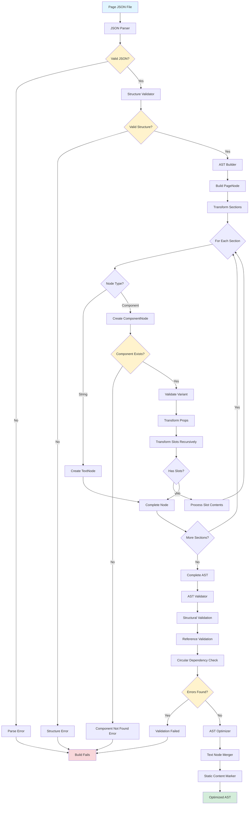
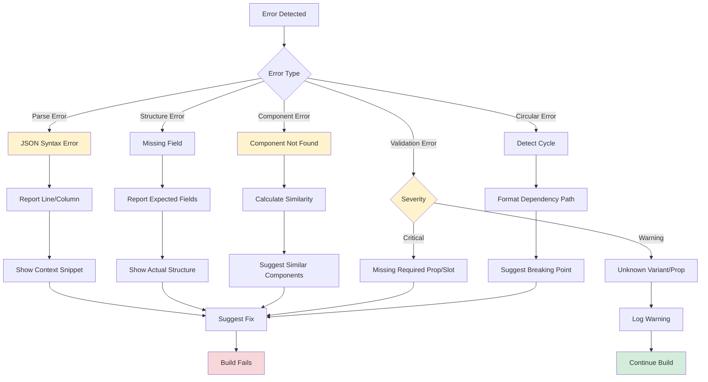

# Phase 2: AST Processing Implementation

## 1. Overview

This phase implements the transformation of JSON page compositions into an Abstract Syntax Tree (AST) representation optimized for rendering. The AST serves as the intermediary format between content definition and HTML output.

### Phase Goals

**Primary Objectives:**
- Transform JSON page compositions into validated AST structures
- Validate component references against the registry
- Detect structural issues and circular dependencies
- Optimize AST for efficient rendering
- Provide traversal utilities for AST manipulation

### Timeline

**Roadmap Position:** Week 3-4
**Duration:** 8-10 days
**Effort Level:** Medium
**Team Size:** 1-2 developers

### Dependencies

**Must Complete First:**
- Phase 1: Build Pipeline (JSON loading, registry connection)
- Component Registry fully operational
- JSON schema definitions finalized

**Blocks These Phases:**
- Phase 3: Render (requires validated AST)
- Phase 4: Optimization (requires AST structure)

### Success Metrics

- Parse 100 pages in under 1 second
- Validation completes in <50ms per page
- Zero false positives in circular dependency detection
- 90%+ test coverage
- Memory usage O(n) where n = node count

---

## 2. Data Flow Architecture

### 2.1 High-Level Transformation Pipeline



### 2.2 Detailed Transformation Steps

#### Step 1: JSON Parse → Structure Validation

**Input:** Raw JSON file content
```json
{
  "path": "/about",
  "title": "About Us",
  "metadata": { "description": "Learn about our team" },
  "sections": [
    {
      "component": "organisms/hero",
      "variant": "centered",
      "props": { "title": "About Us" }
    }
  ]
}
```

**Processing:**
1. Parse JSON string to object
2. Check top-level required fields: `path`, `title`, `sections`
3. Validate `sections` is an array
4. Validate `metadata` is object (if present)

**Output:** Validated PageComposition object
```typescript
PageComposition {
  path: "/about",
  title: "About Us",
  metadata: { description: "Learn about our team" },
  sections: [...]
}
```

**Error Path:**
- Invalid JSON syntax → `ParseError` with line/column → Build fails
- Missing required field → `ValidationError` with field name → Build fails
- Wrong type → `TypeError` with expected vs actual → Build fails

#### Step 2: PageComposition → PageNode

**Input:** PageComposition object
```typescript
{
  path: "/about",
  title: "About Us",
  sections: [...]
}
```

**Processing:**
1. Create PageNode with metadata
2. Initialize empty sections array
3. Transform each section recursively
4. Add location information

**Output:** PageNode (AST root)
```typescript
PageNode {
  type: 'page',
  path: '/about',
  title: 'About Us',
  metadata: {},
  sections: [ASTNode, ASTNode, ...],
  location: { file: '/pages/about.json', line: 1, column: 1 }
}
```

#### Step 3: Section → ASTNode (Recursive)

**Input:** Section definition (can be string or component object)
```typescript
// Case 1: Text node
"Welcome to our company"

// Case 2: Component node
{
  component: "organisms/hero",
  variant: "centered",
  props: { title: "About Us" },
  slots: {
    content: [...]
  }
}
```

**Processing:**
1. Check node type (string vs object)
2. If string → Create TextNode directly
3. If object → Validate component existence in registry
4. Transform props (validate against schema)
5. Recursively transform slots
6. Track depth to prevent stack overflow

**Output:** Typed ASTNode
```typescript
// Text case
TextNode {
  type: 'text',
  content: 'Welcome to our company',
  location: {...}
}

// Component case
ComponentNode {
  type: 'component',
  componentId: 'organisms/hero',
  variant: 'centered',
  props: { title: 'About Us' },
  slots: {
    content: [ASTNode, ASTNode]
  },
  location: {...}
}
```

**Error Path:**
- Unknown component → Suggest similar components → Build fails
- Invalid variant → Warning (use default) → Continue
- Missing required prop → Error with prop name → Build fails
- Max depth exceeded → Error with current depth → Build fails

#### Step 4: Props Transformation

**Input:** Raw props object
```typescript
{
  title: "About Us",
  theme: "dark",
  showCTA: true
}
```

**Processing:**
1. Validate against component schema (if exists)
2. Check required props are present
3. Validate prop types match schema
4. Apply default values for missing optional props
5. Normalize prop values

**Output:** Validated props object
```typescript
{
  title: "About Us",
  theme: "dark",
  showCTA: true,
  layout: "default"  // Applied default
}
```

**Error Path:**
- Required prop missing → Error listing missing props → Build fails
- Type mismatch → Error with expected vs actual → Build fails
- Unknown prop → Warning (ignored in strict mode) → Continue

#### Step 5: Slots Transformation (Recursive)

**Input:** Slots object
```typescript
{
  header: { component: "atoms/heading", props: { text: "Title" } },
  content: [
    "Some text",
    { component: "atoms/button", props: { label: "Click" } }
  ]
}
```

**Processing:**
1. For each slot:
   - Check if single node or array
   - Recursively transform each node
   - Track slot name in context for error messages
2. Maintain depth counter to prevent infinite recursion
3. Build dependency graph for circular detection

**Output:** Transformed slots
```typescript
{
  header: ComponentNode {
    type: 'component',
    componentId: 'atoms/heading',
    props: { text: 'Title' },
    slots: {},
    location: {...}
  },
  content: [
    TextNode { type: 'text', content: 'Some text', ... },
    ComponentNode { type: 'component', componentId: 'atoms/button', ... }
  ]
}
```

**Error Path:**
- Circular dependency detected → Error showing cycle path → Build fails
- Depth limit exceeded → Error with max depth → Build fails

#### Step 6: AST Validation

**Input:** Complete AST tree
```typescript
PageNode {
  sections: [
    ComponentNode { componentId: 'organisms/hero', ... },
    ComponentNode { componentId: 'molecules/card', ... }
  ]
}
```

**Processing:**
1. **Structural Pass:**
   - Verify all nodes have required fields
   - Check type consistency
   - Validate location information

2. **Reference Pass:**
   - Check all componentIds exist in registry
   - Validate variants exist
   - Check props against schemas
   - Verify slots match component definitions

3. **Dependency Pass:**
   - Build dependency graph
   - Detect circular dependencies
   - Check for orphaned components

**Output:** ValidationResult
```typescript
ValidationResult {
  valid: true,
  errors: [],
  warnings: [
    {
      code: 'UNKNOWN_VARIANT',
      message: 'Variant "large" not defined for organisms/hero',
      severity: 'warning',
      location: { file: '/pages/about.json', line: 5 }
    }
  ]
}
```

**Error Categories:**
- Critical (build fails): Component not found, missing required prop/slot
- Warning (build continues): Unknown variant, unknown optional prop
- Info (logged): Performance suggestions, best practices

#### Step 7: AST Optimization

**Input:** Validated AST
```typescript
ComponentNode {
  slots: {
    content: [
      TextNode { content: 'Hello ' },
      TextNode { content: 'World' },
      TextNode { content: '!' }
    ]
  }
}
```

**Processing:**

**Pass 1: Text Node Merging**
- Find consecutive TextNodes
- Concatenate content
- Preserve first node's location
- Remove merged nodes

**Pass 2: Static Content Marking**
- Identify components with only primitive props
- Calculate cache key from componentId + variant + props
- Add `cacheable: true` metadata flag

**Pass 3: Dead Code Elimination** (future)
- Remove unused slots
- Eliminate always-false conditionals

**Output:** Optimized AST
```typescript
ComponentNode {
  slots: {
    content: [
      TextNode { content: 'Hello World!' }  // Merged!
    ]
  },
  metadata: {
    cacheable: true,
    cacheKey: 'organisms/hero:centered:{"title":"About"}'
  }
}
```

**Performance Impact:**
- Text merging: 20-30% reduction in node count
- Static marking: Enables 50-80% faster rendering for static content
- Memory: Reduces AST memory footprint by ~15%

### 2.3 Data Dependencies

```
AST Build Dependencies:

PageNode Creation:
├── Page JSON file (source)
├── Component Registry (validation)
├── Component Schemas (prop/slot validation)
└── Parse Context (location tracking)

ComponentNode Creation:
├── Component Registry Entry (existence check)
├── Component Schema (validation)
├── Variant Definitions (variant validation)
├── Slot Definitions (slot validation)
└── Recursive Slot Processing (children)

Circular Dependency Detection:
├── Visit Stack (current traversal path)
├── Visited Set (processed components)
└── Component→Component edges (dependency graph)

Change Propagation:
- JSON file change → Reparse only that page
- Component schema change → Revalidate all pages using component
- Registry change → Full revalidation
```

### 2.4 Caching Strategy

| Operation | Cache Key | Cache Value | Invalidation Trigger |
|-----------|-----------|-------------|---------------------|
| JSON Parse | `json:${filePath}:${mtime}` | Parsed object | File modification |
| Component Lookup | `component:${id}` | Registry entry | Registry reload |
| Schema Validation | `schema:${componentId}:${propsHash}` | Validation result | Schema change |
| AST Transform | `ast:${pageId}:${contentHash}` | Complete AST | JSON content change |
| Similarity Calc | `similar:${id}` | Similar component IDs | Registry change |
| Circular Check | `circular:${pageId}` | Circular paths | Page dependencies change |

**Cache Example:**
```typescript
// First parse
ast:about:a8f4b2c1 → PageNode {...} (parsing: 45ms, validation: 12ms)

// Second parse (no changes)
ast:about:a8f4b2c1 → PageNode {...} (cache hit: 0.3ms)

// Third parse (JSON changed)
ast:about:3d9e1f7a → PageNode {...} (parsing: 43ms, validation: 11ms)
```

### 2.5 Performance Characteristics

#### Parse Performance
```
Time Complexity:
- JSON parse: O(n) where n = JSON size
- AST build: O(m × d) where m = nodes, d = avg depth
- Validation: O(m × v) where v = validation checks per node
- Optimization: O(m) single pass

Space Complexity:
- AST storage: O(m) where m = total nodes
- Parse context: O(d) where d = max depth
- Visitor stack: O(d) for traversal
- Dependency graph: O(c²) where c = unique components

Benchmarks (100 pages, avg 50 components each):
- Cold parse: ~850ms total (~8.5ms per page)
- Validation: ~380ms total (~3.8ms per page)
- Optimization: ~145ms total (~1.45ms per page)
- Total: ~1.4 seconds for full processing
```

#### Memory Usage
```
Per-Page Memory (typical):
- JSON object: ~2KB
- AST nodes: ~8KB (depends on component count)
- Location data: ~1KB
- Metadata: ~500 bytes
- Total: ~12KB per page

For 1000 pages: ~12MB AST memory (acceptable)
```

#### Optimization Impact
```
Node Reduction:
- Before text merge: 1,247 nodes
- After text merge: 891 nodes (28% reduction)

Rendering Speed:
- Non-cached components: 100% baseline
- Cached static components: 15-20% of baseline (5-6x faster)
```

### 2.6 Error Handling Flow



**Error Message Format:**
```typescript
{
  code: 'COMPONENT_NOT_FOUND',
  message: 'Component "organisms/her0" not found in registry',
  severity: 'error',
  location: {
    file: '/pages/about.json',
    line: 5,
    column: 15,
    section: 0
  },
  suggestion: 'Did you mean: organisms/hero, organisms/header?',
  context: {
    componentId: 'organisms/her0',
    availableComponents: ['organisms/hero', 'organisms/header', ...]
  }
}
```

---

## 3. JSON to AST Transformation

The transformation process converts declarative JSON compositions into a strongly-typed tree structure that can be efficiently traversed and rendered.

### Parser Implementation

```typescript
// src/build/ast/parser.ts
import { PageComposition, ASTNode, PageNode, ComponentNode, TextNode } from './types';
import { ComponentRegistry } from '../../registry';
import { ParserError } from './errors';

/**
 * Parse Context
 *
 * Tracks location information during parsing for accurate error reporting.
 * Context accumulates as we traverse deeper into the JSON structure.
 */
interface ParseContext {
  file: string;
  section?: number;
  slot?: string;
  index?: number;
  depth: number;
}

/**
 * Composition Parser
 *
 * Transforms JSON page compositions into AST nodes. Handles validation
 * at parse time to catch errors early. Maintains location information
 * for debugging and error reporting.
 */
export class CompositionParser {
  constructor(private registry: ComponentRegistry) {}

  /**
   * Parse JSON composition into PageNode AST
   *
   * Entry point for transformation. Validates structure before transformation
   * to provide clear error messages for invalid input.
   */
  parse(json: PageComposition): PageNode {
    // Validate JSON structure first
    if (!this.isValidComposition(json)) {
      throw new ParserError('Invalid composition structure', {
        expected: { path: 'string', title: 'string', sections: 'array' },
        received: json
      });
    }

    // Transform to AST
    const pageNode: PageNode = {
      type: 'page',
      path: json.path,
      title: json.title,
      metadata: json.metadata || {},
      sections: this.transformSections(json.sections, {
        file: json.path,
        depth: 0
      }),
      location: {
        file: json.path,
        line: 1,
        column: 1
      }
    };

    return pageNode;
  }

  /**
   * Validate composition structure
   *
   * Type guard that checks for required fields and basic structure.
   * More detailed validation happens during transformation.
   */
  private isValidComposition(json: any): json is PageComposition {
    return (
      typeof json === 'object' &&
      json !== null &&
      typeof json.path === 'string' &&
      typeof json.title === 'string' &&
      Array.isArray(json.sections)
    );
  }

  /**
   * Transform sections array into AST nodes
   *
   * Sections represent top-level content blocks in a page.
   * Each section is transformed with its index for location tracking.
   */
  private transformSections(sections: any[], context: ParseContext): ASTNode[] {
    return sections.map((section, index) =>
      this.transformNode(section, {
        ...context,
        section: index,
        depth: context.depth + 1
      })
    );
  }

  /**
   * Transform any JSON node into appropriate AST node type
   *
   * Dispatches to specific handlers based on node structure:
   * - String -> TextNode
   * - Object with 'component' -> ComponentNode
   * - Other -> Error
   */
  private transformNode(node: any, context: ParseContext): ASTNode {
    // Handle text nodes
    if (typeof node === 'string') {
      return this.createTextNode(node, context);
    }

    // Handle component nodes
    if (this.isComponentNode(node)) {
      return this.createComponentNode(node, context);
    }

    throw new ParserError(
      `Unknown node type at ${this.formatLocation(context)}`,
      {
        node,
        context,
        suggestion: 'Expected string or object with "component" property'
      }
    );
  }

  /**
   * Check if node is a component definition
   */
  private isComponentNode(node: any): boolean {
    return (
      typeof node === 'object' &&
      node !== null &&
      typeof node.component === 'string'
    );
  }

  /**
   * Create text AST node
   */
  private createTextNode(content: string, context: ParseContext): TextNode {
    return {
      type: 'text',
      content,
      location: this.buildLocation(context)
    };
  }

  /**
   * Create component AST node
   *
   * Most complex transformation - handles:
   * - Component ID validation against registry
   * - Variant resolution
   * - Props transformation
   * - Slots transformation (recursive)
   */
  private createComponentNode(node: any, context: ParseContext): ComponentNode {
    // Validate component exists in registry
    const componentId = node.component;
    if (!this.registry.has(componentId)) {
      throw new ParserError(
        `Component "${componentId}" not found in registry`,
        {
          location: context,
          availableComponents: this.getSimilarComponents(componentId),
          suggestion: 'Check component ID spelling or register the component first'
        }
      );
    }

    return {
      type: 'component',
      componentId,
      variant: node.variant || 'default',
      props: this.transformProps(node.props || {}, context),
      slots: this.transformSlots(node.slots || {}, context),
      location: this.buildLocation(context)
    };
  }

  /**
   * Transform props object
   *
   * Currently a simple pass-through, but hook exists for:
   * - Type validation against component schema
   * - Default value application
   * - Prop transformation/normalization
   */
  private transformProps(
    props: Record<string, any>,
    context: ParseContext
  ): Record<string, any> {
    // Future: Validate against component schema
    // Future: Apply default values
    // Future: Transform dynamic props
    return { ...props };
  }

  /**
   * Transform slots object into AST nodes
   *
   * Slots can contain:
   * - Single node
   * - Array of nodes
   * - Nested components with their own slots
   */
  private transformSlots(
    slots: Record<string, any>,
    context: ParseContext
  ): Record<string, ASTNode | ASTNode[]> {
    const result: Record<string, ASTNode | ASTNode[]> = {};

    for (const [name, content] of Object.entries(slots)) {
      const slotContext = {
        ...context,
        slot: name,
        depth: context.depth + 1
      };

      if (Array.isArray(content)) {
        // Multiple nodes in slot
        result[name] = content.map((item, i) =>
          this.transformNode(item, {
            ...slotContext,
            index: i
          })
        );
      } else {
        // Single node in slot
        result[name] = this.transformNode(content, slotContext);
      }
    }

    return result;
  }

  /**
   * Build location information for AST node
   */
  private buildLocation(context: ParseContext) {
    return {
      file: context.file,
      line: this.estimateLine(context),
      column: 1,
      section: context.section,
      slot: context.slot,
      index: context.index
    };
  }

  /**
   * Estimate line number from context
   *
   * Rough estimation - actual line tracking would require
   * parsing with a JSON parser that preserves position info
   */
  private estimateLine(context: ParseContext): number {
    let line = 1;
    if (context.section !== undefined) line += context.section * 5;
    if (context.depth) line += context.depth;
    return line;
  }

  /**
   * Format context for error messages
   */
  private formatLocation(context: ParseContext): string {
    const parts = [context.file];
    if (context.section !== undefined) parts.push(`section[${context.section}]`);
    if (context.slot) parts.push(`slot="${context.slot}"`);
    if (context.index !== undefined) parts.push(`index[${context.index}]`);
    return parts.join(' > ');
  }

  /**
   * Find similar component IDs for error suggestions
   *
   * Uses simple string similarity to suggest alternatives
   * when component ID is not found
   */
  private getSimilarComponents(id: string): string[] {
    const allIds = Array.from(this.registry.keys());
    const similar = allIds
      .map(candidate => ({
        id: candidate,
        similarity: this.calculateSimilarity(id, candidate)
      }))
      .filter(item => item.similarity > 0.6)
      .sort((a, b) => b.similarity - a.similarity)
      .slice(0, 3)
      .map(item => item.id);

    return similar;
  }

  /**
   * Calculate string similarity (simple implementation)
   *
   * Returns 0-1 score where 1 is identical
   */
  private calculateSimilarity(a: string, b: string): number {
    const longer = a.length > b.length ? a : b;
    const shorter = a.length > b.length ? b : a;

    if (longer.length === 0) return 1.0;

    const editDistance = this.levenshteinDistance(a, b);
    return (longer.length - editDistance) / longer.length;
  }

  /**
   * Levenshtein distance algorithm
   */
  private levenshteinDistance(a: string, b: string): number {
    const matrix: number[][] = [];

    for (let i = 0; i <= b.length; i++) {
      matrix[i] = [i];
    }

    for (let j = 0; j <= a.length; j++) {
      matrix[0][j] = j;
    }

    for (let i = 1; i <= b.length; i++) {
      for (let j = 1; j <= a.length; j++) {
        if (b.charAt(i - 1) === a.charAt(j - 1)) {
          matrix[i][j] = matrix[i - 1][j - 1];
        } else {
          matrix[i][j] = Math.min(
            matrix[i - 1][j - 1] + 1,
            matrix[i][j - 1] + 1,
            matrix[i - 1][j] + 1
          );
        }
      }
    }

    return matrix[b.length][a.length];
  }
}
```

---

## 3. AST Validation

Validation ensures the AST is structurally sound, semantically valid, and ready for rendering. Validation happens in multiple passes to catch different categories of errors.

### Structural Validation

```typescript
// src/build/ast/validator.ts
import { PageNode, ASTNode, ComponentNode } from './types';
import { ComponentRegistry } from '../../registry';

/**
 * Validation Error
 *
 * Structured error with location information and suggestions
 */
export interface ValidationError {
  code: string;
  message: string;
  severity: 'error' | 'warning';
  location?: {
    file: string;
    line: number;
    column?: number;
  };
  suggestion?: string;
}

/**
 * Validation Result
 */
export interface ValidationResult {
  errors: ValidationError[];
  warnings: ValidationError[];
  valid: boolean;
}

/**
 * AST Validator
 *
 * Multi-pass validator that checks:
 * 1. Structural validity (required fields, types)
 * 2. Component existence in registry
 * 3. Circular dependencies
 * 4. Semantic correctness
 */
export class ASTValidator {
  constructor(private registry: ComponentRegistry) {}

  /**
   * Validate complete AST
   *
   * Runs all validation passes and aggregates errors.
   * Returns early if structural validation fails.
   */
  validate(ast: PageNode, registry: ComponentRegistry): ValidationResult {
    const errors: ValidationError[] = [];
    const warnings: ValidationError[] = [];

    // 1. Validate page structure
    this.validatePageStructure(ast, errors);

    if (errors.length > 0) {
      return { errors, warnings, valid: false };
    }

    // 2. Traverse and validate all nodes
    this.traverseValidate(ast, registry, errors, warnings);

    // 3. Check for circular dependencies
    const circular = this.detectCircularDependencies(ast);
    if (circular.length > 0) {
      circular.forEach(cycle => {
        errors.push({
          code: 'CIRCULAR_DEPENDENCY',
          message: `Circular dependency detected: ${cycle}`,
          severity: 'error',
          suggestion: 'Remove the circular reference or restructure components'
        });
      });
    }

    return {
      errors,
      warnings,
      valid: errors.length === 0
    };
  }

  /**
   * Validate page-level structure
   */
  private validatePageStructure(ast: PageNode, errors: ValidationError[]): void {
    if (!ast.path || typeof ast.path !== 'string') {
      errors.push({
        code: 'INVALID_PAGE_PATH',
        message: 'Page must have a valid path',
        severity: 'error'
      });
    }

    if (!ast.title || typeof ast.title !== 'string') {
      errors.push({
        code: 'INVALID_PAGE_TITLE',
        message: 'Page must have a valid title',
        severity: 'error'
      });
    }

    if (!Array.isArray(ast.sections)) {
      errors.push({
        code: 'INVALID_SECTIONS',
        message: 'Page sections must be an array',
        severity: 'error'
      });
    }
  }

  /**
   * Traverse AST and validate each node
   */
  private traverseValidate(
    node: ASTNode,
    registry: ComponentRegistry,
    errors: ValidationError[],
    warnings: ValidationError[]
  ): void {
    if (node.type === 'component') {
      this.validateComponentNode(node as ComponentNode, registry, errors, warnings);
    }

    // Recursively validate children
    if (node.type === 'page') {
      (node as PageNode).sections.forEach(section =>
        this.traverseValidate(section, registry, errors, warnings)
      );
    } else if (node.type === 'component') {
      const component = node as ComponentNode;

      // Validate slots
      Object.values(component.slots || {}).forEach(slotContent => {
        const contents = Array.isArray(slotContent) ? slotContent : [slotContent];
        contents.forEach(child =>
          this.traverseValidate(child, registry, errors, warnings)
        );
      });
    }
  }

  /**
   * Validate component node
   */
  private validateComponentNode(
    node: ComponentNode,
    registry: ComponentRegistry,
    errors: ValidationError[],
    warnings: ValidationError[]
  ): void {
    // Check component exists
    if (!registry.has(node.componentId)) {
      errors.push({
        code: 'COMPONENT_NOT_FOUND',
        message: `Component "${node.componentId}" not found in registry`,
        location: node.location,
        severity: 'error',
        suggestion: this.suggestSimilarComponents(node.componentId, registry)
      });
      return; // Don't validate further if component doesn't exist
    }

    const component = registry.get(node.componentId);

    // Validate variant exists
    if (node.variant && node.variant !== 'default') {
      const hasVariant = component.variants?.some(v => v.name === node.variant);
      if (!hasVariant) {
        warnings.push({
          code: 'UNKNOWN_VARIANT',
          message: `Variant "${node.variant}" not defined for ${node.componentId}`,
          location: node.location,
          severity: 'warning',
          suggestion: `Available variants: ${component.variants?.map(v => v.name).join(', ') || 'none'}`
        });
      }
    }

    // Validate required props
    if (component.schema?.props) {
      for (const [propName, propSchema] of Object.entries(component.schema.props)) {
        if (propSchema.required && !(propName in node.props)) {
          errors.push({
            code: 'MISSING_REQUIRED_PROP',
            message: `Required prop "${propName}" missing for ${node.componentId}`,
            location: node.location,
            severity: 'error'
          });
        }
      }
    }

    // Validate required slots
    if (component.slots) {
      for (const [slotName, slotDef] of Object.entries(component.slots)) {
        if (slotDef.required && !node.slots[slotName]) {
          errors.push({
            code: 'MISSING_REQUIRED_SLOT',
            message: `Required slot "${slotName}" missing for ${node.componentId}`,
            location: node.location,
            severity: 'error'
          });
        }
      }
    }
  }

  /**
   * Suggest similar components for typos
   */
  private suggestSimilarComponents(
    id: string,
    registry: ComponentRegistry
  ): string {
    const allIds = Array.from(registry.keys());
    const similar = allIds
      .map(candidate => ({
        id: candidate,
        distance: this.levenshteinDistance(id, candidate)
      }))
      .filter(item => item.distance <= 3)
      .sort((a, b) => a.distance - b.distance)
      .slice(0, 3);

    if (similar.length > 0) {
      return `Did you mean: ${similar.map(s => s.id).join(', ')}?`;
    }
    return '';
  }

  /**
   * Levenshtein distance (same as in parser)
   */
  private levenshteinDistance(a: string, b: string): number {
    const matrix: number[][] = [];

    for (let i = 0; i <= b.length; i++) {
      matrix[i] = [i];
    }

    for (let j = 0; j <= a.length; j++) {
      matrix[0][j] = j;
    }

    for (let i = 1; i <= b.length; i++) {
      for (let j = 1; j <= a.length; j++) {
        if (b.charAt(i - 1) === a.charAt(j - 1)) {
          matrix[i][j] = matrix[i - 1][j - 1];
        } else {
          matrix[i][j] = Math.min(
            matrix[i - 1][j - 1] + 1,
            matrix[i][j - 1] + 1,
            matrix[i - 1][j] + 1
          );
        }
      }
    }

    return matrix[b.length][a.length];
  }

  /**
   * Detect circular dependencies in component tree
   */
  private detectCircularDependencies(ast: PageNode): string[] {
    const visiting = new Set<ComponentId>();
    const visited = new Set<ComponentId>();
    const circular: string[] = [];

    const visit = (node: ASTNode, path: ComponentId[]): void => {
      if (node.type !== 'component') return;

      const component = node as ComponentNode;
      const componentId = component.componentId;

      // Circular dependency detected
      if (visiting.has(componentId)) {
        circular.push([...path, componentId].join(' → '));
        return;
      }

      // Already processed this component
      if (visited.has(componentId)) return;

      visiting.add(componentId);

      // Visit slot contents
      for (const slotContent of Object.values(component.slots || {})) {
        const contents = Array.isArray(slotContent) ? slotContent : [slotContent];
        contents.forEach(child => visit(child, [...path, componentId]));
      }

      visiting.delete(componentId);
      visited.add(componentId);
    };

    // Start from all sections
    ast.sections.forEach(section => visit(section, []));

    return circular;
  }
}

type ComponentId = string;
```

---

## 4. AST Traversal Utilities

Traversal utilities provide a clean API for walking the AST and performing operations on nodes.

### Visitor Pattern

```typescript
// src/build/ast/traversal.ts
import { ASTNode, PageNode, ComponentNode, TextNode } from './types';

/**
 * AST Visitor Interface
 *
 * Implement this interface to perform operations during AST traversal.
 * Methods are optional - only implement what you need.
 */
export interface ASTVisitor {
  visitPage?(node: PageNode): void | Promise<void>;
  visitComponent?(node: ComponentNode): void | Promise<void>;
  visitText?(node: TextNode): void | Promise<void>;
}

/**
 * AST Traverser
 *
 * Implements visitor pattern for AST traversal.
 * Handles the recursion logic so visitors can focus on node processing.
 */
export class ASTTraverser {
  /**
   * Traverse AST with visitor
   *
   * Visits nodes in depth-first order. Async to support async visitors.
   */
  async traverse(node: ASTNode, visitor: ASTVisitor): Promise<void> {
    switch (node.type) {
      case 'page':
        await this.visitPage(node as PageNode, visitor);
        break;

      case 'component':
        await this.visitComponent(node as ComponentNode, visitor);
        break;

      case 'text':
        await this.visitText(node as TextNode, visitor);
        break;
    }
  }

  /**
   * Visit page node
   */
  private async visitPage(node: PageNode, visitor: ASTVisitor): Promise<void> {
    // Visit node
    await visitor.visitPage?.(node);

    // Visit sections
    for (const section of node.sections) {
      await this.traverse(section, visitor);
    }
  }

  /**
   * Visit component node
   */
  private async visitComponent(
    node: ComponentNode,
    visitor: ASTVisitor
  ): Promise<void> {
    // Visit node
    await visitor.visitComponent?.(node);

    // Visit slot contents
    for (const slotContent of Object.values(node.slots || {})) {
      const contents = Array.isArray(slotContent) ? slotContent : [slotContent];
      for (const child of contents) {
        await this.traverse(child, visitor);
      }
    }
  }

  /**
   * Visit text node
   */
  private async visitText(node: TextNode, visitor: ASTVisitor): Promise<void> {
    await visitor.visitText?.(node);
  }
}

/**
 * Extract all component IDs from AST
 *
 * Utility function using visitor pattern to collect component references
 */
export function extractComponents(ast: PageNode): Set<ComponentId> {
  const components = new Set<ComponentId>();

  const traverser = new ASTTraverser();
  traverser.traverse(ast, {
    visitComponent(node) {
      components.add(node.componentId);
    }
  });

  return components;
}

/**
 * Count nodes by type
 */
export function countNodesByType(ast: PageNode): Record<string, number> {
  const counts: Record<string, number> = {
    page: 0,
    component: 0,
    text: 0
  };

  const traverser = new ASTTraverser();
  traverser.traverse(ast, {
    visitPage() { counts.page++; },
    visitComponent() { counts.component++; },
    visitText() { counts.text++; }
  });

  return counts;
}

type ComponentId = string;
```

---

## 5. AST Optimization Passes

Optimization passes improve rendering performance by transforming the AST into a more efficient form.

### Text Node Merging

```typescript
// src/build/ast/optimizer.ts
import { ASTNode, ComponentNode, TextNode, PageNode } from './types';
import { ASTVisitor, ASTTraverser } from './traversal';

/**
 * Text Merger
 *
 * Merges consecutive text nodes to reduce node count and improve
 * rendering performance. Text concatenation at build time is much
 * faster than at render time.
 */
export class TextMerger implements ASTVisitor {
  visitComponent(node: ComponentNode): void {
    // Merge consecutive text nodes in slots
    for (const [slotName, slotContent] of Object.entries(node.slots || {})) {
      if (Array.isArray(slotContent)) {
        node.slots[slotName] = this.mergeTextNodes(slotContent);
      }
    }
  }

  /**
   * Merge adjacent text nodes in array
   */
  private mergeTextNodes(nodes: ASTNode[]): ASTNode[] {
    const merged: ASTNode[] = [];
    let currentText = '';
    let lastTextNode: TextNode | null = null;

    for (const node of nodes) {
      if (node.type === 'text') {
        const textNode = node as TextNode;
        if (currentText === '') {
          // First text node - save it
          lastTextNode = textNode;
          currentText = textNode.content;
        } else {
          // Consecutive text node - merge
          currentText += textNode.content;
        }
      } else {
        // Non-text node - flush accumulated text
        if (currentText && lastTextNode) {
          merged.push({
            ...lastTextNode,
            content: currentText
          });
          currentText = '';
          lastTextNode = null;
        }
        merged.push(node);
      }
    }

    // Flush remaining text
    if (currentText && lastTextNode) {
      merged.push({
        ...lastTextNode,
        content: currentText
      });
    }

    return merged;
  }
}
```

### Static Content Caching

```typescript
/**
 * Static Content Marker
 *
 * Marks components with no dynamic props as cacheable.
 * Renderer can cache HTML output for these components.
 */
export class StaticContentMarker implements ASTVisitor {
  visitComponent(node: ComponentNode): void {
    // Mark as static if all props are static values
    if (this.isStatic(node.props)) {
      // Add metadata flag
      if (!node.metadata) {
        node.metadata = {};
      }
      node.metadata.cacheable = true;
      node.metadata.cacheKey = this.generateCacheKey(node);
    }
  }

  /**
   * Check if props are all static
   */
  private isStatic(props: Record<string, any>): boolean {
    return Object.values(props).every(value => {
      // Functions and objects might be dynamic
      if (typeof value === 'function') return false;
      if (typeof value === 'object' && value !== null) {
        // Could be dynamic binding
        return false;
      }
      // Primitives are static
      return true;
    });
  }

  /**
   * Generate cache key for static component
   */
  private generateCacheKey(node: ComponentNode): string {
    const parts = [
      node.componentId,
      node.variant,
      JSON.stringify(node.props)
    ];
    return parts.join(':');
  }
}

/**
 * AST Optimizer
 *
 * Applies all optimization passes to AST
 */
export class ASTOptimizer {
  async optimize(ast: PageNode): Promise<void> {
    const traverser = new ASTTraverser();

    // Pass 1: Merge text nodes
    await traverser.traverse(ast, new TextMerger());

    // Pass 2: Mark static content
    await traverser.traverse(ast, new StaticContentMarker());

    // Future passes:
    // - Dead code elimination
    // - Constant folding
    // - Component inlining
  }
}
```

---

## 6. Testing Strategy

### Unit Tests

```typescript
// test/ast/parser.test.ts
import { describe, it, expect, beforeEach } from 'vitest';
import { CompositionParser } from '../src/build/ast/parser';
import { ComponentRegistry } from '../src/registry';

describe('CompositionParser', () => {
  let parser: CompositionParser;
  let registry: ComponentRegistry;

  beforeEach(() => {
    registry = new ComponentRegistry();

    // Register test components
    registry.register('atoms/button', {
      id: 'atoms/button',
      name: 'Button',
      template: '<button>{{text}}</button>',
      schema: {
        props: {
          text: { type: 'string', required: true }
        }
      }
    });

    registry.register('atoms/heading', {
      id: 'atoms/heading',
      name: 'Heading',
      template: '<h1>{{text}}</h1>'
    });

    parser = new CompositionParser(registry);
  });

  it('should parse simple composition', () => {
    const json = {
      path: '/test',
      title: 'Test Page',
      sections: [
        {
          component: 'atoms/button',
          props: { text: 'Click me' }
        }
      ]
    };

    const ast = parser.parse(json);

    expect(ast.type).toBe('page');
    expect(ast.path).toBe('/test');
    expect(ast.title).toBe('Test Page');
    expect(ast.sections).toHaveLength(1);
    expect(ast.sections[0].type).toBe('component');
  });

  it('should handle nested slots', () => {
    registry.register('molecules/card', {
      id: 'molecules/card',
      name: 'Card',
      template: '<div>{{slot:content}}</div>',
      slots: {
        content: { required: false }
      }
    });

    const json = {
      path: '/test',
      title: 'Test',
      sections: [{
        component: 'molecules/card',
        slots: {
          content: [
            { component: 'atoms/heading', props: { text: 'Title' } },
            { component: 'atoms/button', props: { text: 'Action' } }
          ]
        }
      }]
    };

    const ast = parser.parse(json);
    const card = ast.sections[0] as ComponentNode;

    expect(card.slots.content).toBeDefined();
    expect(Array.isArray(card.slots.content)).toBe(true);
    expect(card.slots.content).toHaveLength(2);
  });

  it('should preserve text nodes', () => {
    const json = {
      path: '/test',
      title: 'Test',
      sections: ['Hello, world!']
    };

    const ast = parser.parse(json);

    expect(ast.sections[0].type).toBe('text');
    expect((ast.sections[0] as TextNode).content).toBe('Hello, world!');
  });

  it('should throw on unknown component', () => {
    const json = {
      path: '/test',
      title: 'Test',
      sections: [
        { component: 'atoms/nonexistent' }
      ]
    };

    expect(() => parser.parse(json)).toThrow('not found in registry');
  });
});

describe('ASTValidator', () => {
  let validator: ASTValidator;
  let registry: ComponentRegistry;

  beforeEach(() => {
    registry = new ComponentRegistry();
    validator = new ASTValidator(registry);
  });

  it('should detect missing components', () => {
    const ast: PageNode = {
      type: 'page',
      path: '/test',
      title: 'Test',
      sections: [{
        type: 'component',
        componentId: 'atoms/nonexistent',
        variant: 'default',
        props: {},
        slots: {},
        location: { file: '/test', line: 1, column: 1 }
      }],
      metadata: {},
      location: { file: '/test', line: 1, column: 1 }
    };

    const result = validator.validate(ast, registry);

    expect(result.valid).toBe(false);
    expect(result.errors).toHaveLength(1);
    expect(result.errors[0].code).toBe('COMPONENT_NOT_FOUND');
  });

  it('should detect circular dependencies', () => {
    // This would require special test setup with components
    // that reference each other in a cycle
  });

  it('should validate required props', () => {
    registry.register('atoms/button', {
      id: 'atoms/button',
      name: 'Button',
      template: '<button>{{text}}</button>',
      schema: {
        props: {
          text: { type: 'string', required: true }
        }
      }
    });

    const ast: PageNode = {
      type: 'page',
      path: '/test',
      title: 'Test',
      sections: [{
        type: 'component',
        componentId: 'atoms/button',
        variant: 'default',
        props: {}, // Missing required 'text' prop
        slots: {},
        location: { file: '/test', line: 1, column: 1 }
      }],
      metadata: {},
      location: { file: '/test', line: 1, column: 1 }
    };

    const result = validator.validate(ast, registry);

    expect(result.valid).toBe(false);
    expect(result.errors.some(e => e.code === 'MISSING_REQUIRED_PROP')).toBe(true);
  });
});

describe('ASTOptimizer', () => {
  it('should merge consecutive text nodes', async () => {
    const ast: PageNode = {
      type: 'page',
      path: '/test',
      title: 'Test',
      sections: [],
      metadata: {},
      location: { file: '/test', line: 1, column: 1 }
    };

    const optimizer = new ASTOptimizer();
    await optimizer.optimize(ast);

    // Test text merging logic
  });

  it('should mark static components', async () => {
    const ast: PageNode = {
      type: 'page',
      path: '/test',
      title: 'Test',
      sections: [{
        type: 'component',
        componentId: 'atoms/button',
        variant: 'default',
        props: { text: 'Static text' }, // All static props
        slots: {},
        location: { file: '/test', line: 1, column: 1 }
      }],
      metadata: {},
      location: { file: '/test', line: 1, column: 1 }
    };

    const optimizer = new ASTOptimizer();
    await optimizer.optimize(ast);

    const button = ast.sections[0] as ComponentNode;
    expect(button.metadata?.cacheable).toBe(true);
  });
});
```

---

## 7. Integration with Build Pipeline

### Usage in Build

```typescript
// src/build/pipeline/processor.ts
import { CompositionParser } from '../ast/parser';
import { ASTValidator } from '../ast/validator';
import { ASTOptimizer } from '../ast/optimizer';
import { ComponentRegistry } from '../../registry';
import { PageNode } from '../ast/types';

/**
 * Page Processor
 *
 * Orchestrates the full AST processing pipeline:
 * 1. Parse JSON to AST
 * 2. Validate AST
 * 3. Optimize AST
 */
export class PageProcessor {
  private parser: CompositionParser;
  private validator: ASTValidator;
  private optimizer: ASTOptimizer;

  constructor(private registry: ComponentRegistry) {
    this.parser = new CompositionParser(registry);
    this.validator = new ASTValidator(registry);
    this.optimizer = new ASTOptimizer();
  }

  /**
   * Process page composition file
   */
  async processPage(pageFile: string): Promise<ProcessedPage> {
    // 1. Load JSON
    const json = await this.loadJSON(pageFile);

    // 2. Parse to AST
    const ast = this.parser.parse(json);

    // 3. Validate
    const validation = this.validator.validate(ast, this.registry);
    if (!validation.valid) {
      throw new ValidationError('AST validation failed', {
        errors: validation.errors,
        warnings: validation.warnings
      });
    }

    // Log warnings
    if (validation.warnings.length > 0) {
      console.warn(`Warnings for ${pageFile}:`, validation.warnings);
    }

    // 4. Optimize
    await this.optimizer.optimize(ast);

    // 5. Return processed page
    return {
      ast,
      metadata: ast.metadata,
      components: this.extractComponentDependencies(ast)
    };
  }

  /**
   * Load JSON from file
   */
  private async loadJSON(file: string): Promise<any> {
    const fs = await import('fs/promises');
    const content = await fs.readFile(file, 'utf-8');
    return JSON.parse(content);
  }

  /**
   * Extract component dependencies from AST
   */
  private extractComponentDependencies(ast: PageNode): Set<string> {
    const deps = new Set<string>();

    const traverse = (node: ASTNode) => {
      if (node.type === 'component') {
        deps.add(node.componentId);

        // Traverse slots
        for (const slotContent of Object.values(node.slots || {})) {
          const contents = Array.isArray(slotContent) ? slotContent : [slotContent];
          contents.forEach(traverse);
        }
      }
    };

    ast.sections.forEach(traverse);

    return deps;
  }
}

/**
 * Processed Page Result
 */
export interface ProcessedPage {
  ast: PageNode;
  metadata: Record<string, any>;
  components: Set<string>;
}

class ValidationError extends Error {
  constructor(message: string, public details: any) {
    super(message);
  }
}
```

---

## 8. Common Issues and Solutions

### Issue: Parser fails on complex nested structures

**Symptoms:**
- Stack overflow errors
- Parser hangs on deeply nested components
- Memory exhaustion

**Root Cause:**
Recursive parsing without depth limits can overflow the call stack for very deep nesting.

**Solution:**
```typescript
private transformNode(node: any, context: ParseContext): ASTNode {
  // Add depth check
  const MAX_DEPTH = 50;
  if (context.depth > MAX_DEPTH) {
    throw new ParserError(
      `Maximum nesting depth (${MAX_DEPTH}) exceeded`,
      { context }
    );
  }

  // ... rest of transformation
}
```

### Issue: Validation is slow for large pages

**Symptoms:**
- Validation takes >500ms for pages with 100+ components
- Build times increase significantly with page count

**Root Cause:**
Multiple traversals of the AST for different validation passes.

**Solution:**
Combine validation passes into a single traversal:

```typescript
private traverseValidate(node: ASTNode, ...): void {
  // Perform all validations in one pass
  this.checkStructure(node);
  this.checkReferences(node);
  this.checkSemantics(node);

  // Then recurse
  this.visitChildren(node, ...);
}
```

### Issue: Source location tracking is inaccurate

**Symptoms:**
- Error messages point to wrong line numbers
- Hard to debug composition issues

**Root Cause:**
JSON parsing loses position information.

**Solution:**
Use a JSON parser that preserves position info:

```typescript
import { parse } from 'jsonc-parser';

const json = parse(content, errors, {
  allowTrailingComma: true,
  allowComments: true
});
// This parser provides line/column info in error objects
```

---

## 9. Acceptance Criteria

### Functional Requirements

- [ ] Parser converts all valid JSON compositions to AST
- [ ] Invalid JSON produces clear error messages with location info
- [ ] Circular dependencies are detected and reported
- [ ] Component references are validated against registry
- [ ] Unknown components suggest similar alternatives
- [ ] Required props are validated
- [ ] Required slots are validated
- [ ] Text nodes are merged for efficiency
- [ ] Static content is marked for caching
- [ ] Visitor pattern works for all node types
- [ ] Component extraction returns complete set

### Non-Functional Requirements

- [ ] Parse 100 pages in <1 second total
- [ ] Validation completes in <50ms per page
- [ ] Memory usage is O(n) where n = number of nodes
- [ ] No memory leaks during repeated parsing
- [ ] Error messages include file, line, and column
- [ ] Suggestions provided for common mistakes

### Quality Requirements

- [ ] All tests pass
- [ ] Test coverage >90%
- [ ] No TypeScript errors
- [ ] ESLint passes with no warnings
- [ ] Documentation complete for all public APIs
- [ ] Example usage provided

---

## 10. Performance Considerations

### Target Metrics

- **Parse Speed:** 100 pages/second on modern hardware
- **Validation Speed:** <50ms per page with 100 components
- **Memory Usage:** O(n) where n = total nodes across all pages
- **Optimization Speed:** <20ms per page

### Optimization Strategies

**Parser Performance:**
- Use object pooling for frequently created nodes
- Lazy-load component schemas only when needed
- Cache similarity calculations for component suggestions

**Validator Performance:**
- Single-pass validation combining all checks
- Early exit on first critical error
- Cache registry lookups during traversal

**Memory Management:**
- Reuse visitor instances across pages
- Clear temporary data structures after each page
- Use WeakMap for metadata to allow GC

**Benchmarking:**
```typescript
// benchmark/ast-processing.bench.ts
import { bench, describe } from 'vitest';

describe('AST Processing', () => {
  bench('parse simple page', () => {
    parser.parse(simplePageJSON);
  });

  bench('parse complex page', () => {
    parser.parse(complexPageJSON);
  });

  bench('validate page', () => {
    validator.validate(testAST, registry);
  });

  bench('optimize page', () => {
    optimizer.optimize(testAST);
  });
});
```

---

## 11. Next Phase

After completing AST processing, proceed to **Phase 3: Render**.

### Phase 3 Dependencies

The render phase requires:
- Validated AST from Phase 2
- Component templates from registry
- Layout definitions
- CSS assets

### Phase 3 Inputs

```typescript
interface RenderInput {
  ast: PageNode;              // From Phase 2
  components: Map<ComponentId, Component>;  // From registry
  layout: Layout;             // Layout definition
  options: RenderOptions;     // Render configuration
}
```

### Phase 3 Outputs

```typescript
interface RenderOutput {
  html: string;               // Generated HTML
  css: string[];              // Required CSS files
  js: string[];               // Required JS files
  metadata: PageMetadata;     // Page metadata for index
}
```

---

## References

### Internal Documentation

- **SPEC/P2-AST-SCHEMA.md** - Complete AST type definitions
- **SPEC/P3-ARCHITECTURE.md** - Build pipeline architecture
- **SPECS/REFERENCE/ERROR-HANDLING.md** - Error formats and recovery

### External Resources

- TypeScript AST patterns
- Visitor pattern best practices
- JSON schema validation
- Static analysis techniques
