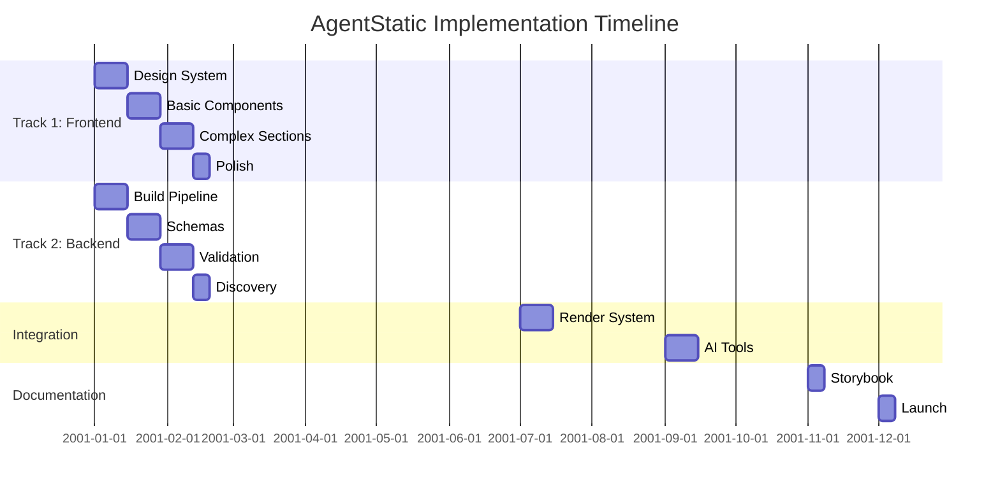

# AgentStatic SPECIFICATION

**The Unified Implementation Plan for AgentStatic**

This directory contains the consolidated, final planning documentation for AgentStatic - an AI-first static site generator for brochureware marketing websites.

---

## 🎯 Project Vision

**AgentStatic** is a three-tier platform that enables both developers and AI agents (particularly Claude) to build beautiful, accessible, performant marketing websites:

1. **Component Library**: 20-30 production-ready CSS components
2. **Build Engine**: Static site generator powered by Bun + Vite
3. **AI Integration**: Claude-optimized MCP tools for autonomous site building

---

## 🏛️ The Four Pillars

AgentStatic is built on four independent but interconnected pillars. **Phase-specific implementation details are now tracked in GitHub Issues** (see section below).

### PILLAR 1: COMPONENT LIBRARY
The visual component system - HTML/CSS components with zero runtime JavaScript.
- **GitHub Epic**: #53 - Component Library
- **GitHub Issues**: #54-#84 (40+ component and design system issues)
- **Reference**: [P1-COMPONENT-SPECS.md](./P1-COMPONENT-SPECS.md)

### PILLAR 2: REGISTRY & VALIDATION
Making components machine-readable and validated for AI consumption.
- **GitHub Epic**: #85 - Registry & Validation System
- **GitHub Issues**: #86-#92 (7 schema and registry issues)
- **Reference**: [P2-AST-SCHEMA.md](./P2-AST-SCHEMA.md)

### PILLAR 3: BUILD ENGINE
Transforming component compositions into optimized static sites.
- **GitHub Epic**: #93 - Build System & Static Site Generation
- **GitHub Issues**: #94-#98 (5 phase issues from foundation to CLI)
- **Reference**: [P3-ARCHITECTURE.md](./P3-ARCHITECTURE.md), [P3-CSS-OPTIMIZATION.md](./P3-CSS-OPTIMIZATION.md), [P3-CLI-INTERFACE.md](./P3-CLI-INTERFACE.md)

### PILLAR 4: AI INTEGRATION
Enabling Claude to autonomously build complete sites.
- **GitHub Epic**: #99 - AI Tools & MCP Integration
- **GitHub Issues**: #100-#104 (6 MCP tool and integration issues)
- **Reference**: [P4-ALGORITHMS.md](./P4-ALGORITHMS.md)

---

## 📅 Implementation Timeline

### Parallel Development Tracks



**Total Duration**: 12 weeks
**Total Effort**: 250-300 hours
**Team Size**: 1-2 developers

---

## 📚 Core Documents

### Planning & Strategy
- **[ROADMAP.md](./ROADMAP.md)** - Detailed timeline, dependencies, and milestones
- **[DECISIONS.md](./DECISIONS.md)** - The 17 architectural decisions that guide the project

### Reference Documentation
- **[TECHNOLOGY-STACK.md](./TECHNOLOGY-STACK.md)** - Technology choices and rationale
- **[SUCCESS-METRICS.md](./SUCCESS-METRICS.md)** - KPIs and targets
- **[ERROR-HANDLING.md](./ERROR-HANDLING.md)** - Error handling patterns and codes
- **[PROJECT-STRUCTURE.md](./PROJECT-STRUCTURE.md)** - File and directory organization

---

## 🎯 Success Metrics

### Component Library
- ✅ 20-30 production-ready components
- ✅ WCAG AA compliance (100%)
- ✅ Mobile-first responsive design
- ✅ Dark mode support (system + manual)

### Performance
- ✅ <50KB CSS bundle (gzipped)
- ✅ 90+ Lighthouse scores
- ✅ <10 second build time
- ✅ Zero runtime JavaScript for core functionality

### AI Integration
- ✅ 5 Claude-optimized MCP tools
- ✅ <100ms component discovery
- ✅ Autonomous page composition from natural language
- ✅ Rich suggestions and error feedback

### Documentation
- ✅ 50-70 Storybook stories
- ✅ Developer guide
- ✅ AI agent guide
- ✅ 2-3 example sites

---

## 🚀 Quick Start Paths

### For Frontend Developers
Start with **PILLAR 1: COMPONENT LIBRARY**
1. Check Epic #53 and Issues #54-#84 in GitHub
2. Read [P1-COMPONENT-SPECS.md](./P1-COMPONENT-SPECS.md) for reference
3. Build components progressively through phases (tracked in issues)

### For Backend Developers
Start with **PILLAR 3: BUILD ENGINE**
1. Check Epic #93 and Issues #94-#98 in GitHub
2. Read [P3-ARCHITECTURE.md](./P3-ARCHITECTURE.md) for reference
3. Start with Issue #94 (Build Foundation & Project Setup)

### For AI/ML Engineers
Start with **PILLAR 4: AI INTEGRATION**
1. Check Epic #99 and Issues #100-#104 in GitHub
2. Review [P4-ALGORITHMS.md](./P4-ALGORITHMS.md) for implementation details
3. Understand [P2-AST-SCHEMA.md](./P2-AST-SCHEMA.md) for component structures

### For Full-Stack Developers
Follow the **[ROADMAP.md](./ROADMAP.md)** for the complete implementation path, using **GitHub Issues for task assignment and progress tracking**.

---

## 📂 File Organization

SPEC now contains **reference and architecture documents only**. Phase-specific implementation details are tracked in GitHub Issues.

```
SPEC/
├── README.md                          # This file
├── ROADMAP.md                         # Timeline & dependencies
├── DECISIONS.md                       # 17 architectural decisions
│
├── REFERENCE DOCUMENTS (for implementation)
├── P1-COMPONENT-SPECS.md              # Component anatomy reference
├── P2-AST-SCHEMA.md                   # AST schema specification
├── P3-ARCHITECTURE.md                 # Build architecture reference
├── P3-CSS-OPTIMIZATION.md             # CSS optimization strategy
├── P3-CLI-INTERFACE.md                # CLI design reference
├── P4-ALGORITHMS.md                   # AI algorithms reference
│
├── ERROR-HANDLING.md                  # Error handling patterns
├── PROJECT-STRUCTURE.md               # File organization
├── SUCCESS-METRICS.md                 # KPIs and targets
└── TECHNOLOGY-STACK.md                # Tech choices
```

**Phase-specific details are now in GitHub Issues:**
- Pillar 1: Epic #53, Issues #54-#84
- Pillar 2: Epic #85, Issues #86-#92
- Pillar 3: Epic #93, Issues #94-#98
- Pillar 4: Epic #99, Issues #100-#104

**Archived documents** (for historical reference):
- See `.archive/SPEC/` for all phase-specific planning documents

---

## 🔄 Relationship to Previous Documentation

This SPEC consolidates and supersedes:
- `.archive/PLANNING/` - Original comprehensive phase-based planning (kept for historical reference)
- `.archive/architecture/` - Technical specifications (merged into pillar documents)
- `/CODESTYLE.md` - Remains as the active code style guide

For implementation, **always refer to SPEC** as the source of truth.

---

## 📝 Key Principles

1. **Pillar Independence**: Each pillar can be developed in isolation
2. **Progressive Enhancement**: Start simple, layer complexity
3. **AI-First Design**: Every decision optimized for AI consumption
4. **Documentation-Driven**: Document before implementing
5. **Accessibility Non-Negotiable**: WCAG AA from day one
6. **Performance Budgets**: Enforce limits at every phase

---

## ❓ Where to Start?

1. **Understand the vision**: Read [DECISIONS.md](./DECISIONS.md) for the 17 guiding principles
2. **Choose your track**: Pick a pillar based on your expertise (see Quick Start Paths above)
3. **Read the phase docs**: Start with Phase 1 of your chosen pillar
4. **Follow the phases**: Work through phases sequentially
5. **Track progress**: Use phase acceptance criteria in each document

---

## 🎉 The Goal

By the end of this plan's implementation, AgentStatic will be:
- A **production-ready** static site generator
- With **20-30 beautiful components**
- That **Claude can use autonomously**
- To build **accessible, performant marketing sites**
- In **minutes instead of weeks**

---

*Last Updated: October 26, 2025*
*Status: Specification Complete (11 reference docs + 104 GitHub Issues), Ready for Implementation*
*Implementation tracked in: GitHub Issues (#53-#104)*